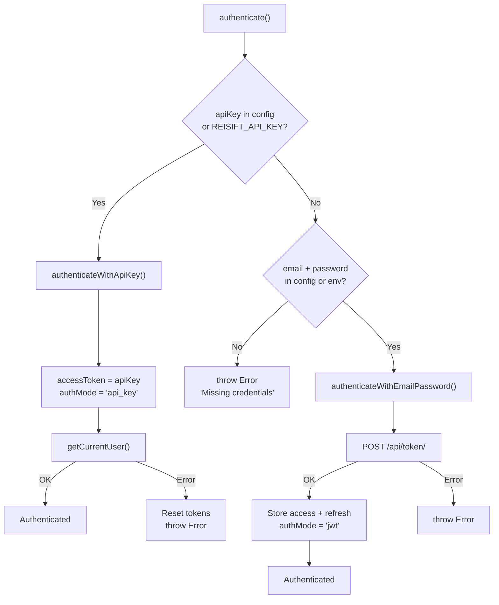
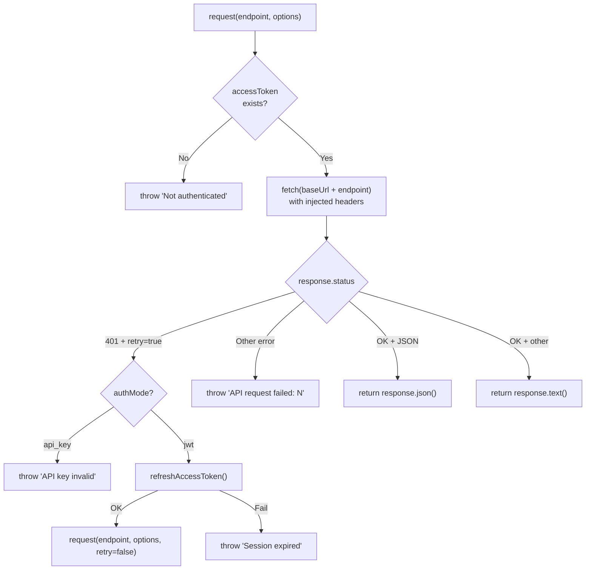
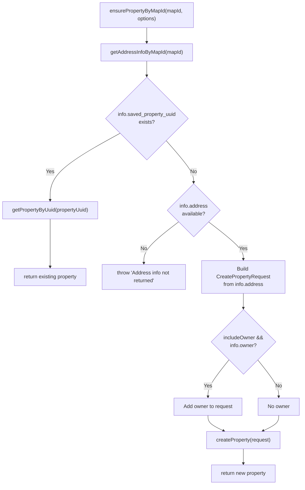
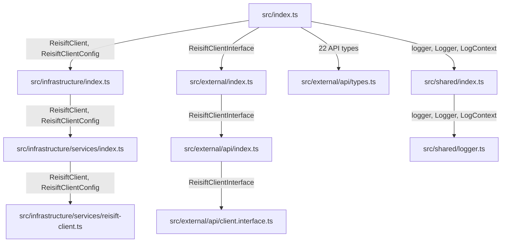

# SDK Map — @dsanchez.co/reisift-sdk

> **Version documented:** 0.3.0
> **Last updated:** 2026-02-17
> **Package name:** `@dsanchez.co/reisift-sdk`

---

## 1. Overview

This SDK is an **unofficial** TypeScript client for the [REISift](https://www.reisift.io) API (a property management platform for real estate investors). It was built through **reverse engineering** of the REISift web app (HAR captures) and limited public documentation.

**What it is:**
- A typed wrapper over discovered REISift HTTP endpoints.
- A single entry point (`ReisiftClient`) with authentication, pagination, and error handling.

**What it is NOT:**
- Not an official REISift SDK.
- Does not cover all platform endpoints; only those discovered and verified.
- Does not guarantee stability against changes to REISift's private API.

---

## 2. Naming contract

This section defines the naming rules followed across the SDK. All code, types, and documentation should be consistent with these conventions.

| Context | Convention | Examples |
|---------|-----------|----------|
| **Product/brand in prose** | `REISift` (official brand casing) | "the REISift API", "REISift web app" |
| **npm package name** | `@dsanchez.co/reisift-sdk` | `npm install @dsanchez.co/reisift-sdk` |
| **Classes / types / interfaces** | PascalCase, prefixed with `Reisift` only for the top-level client | `ReisiftClient`, `PropertySearchResponse` |
| **Methods / params / variables** | camelCase | `searchProperties()`, `propertyUuid` |
| **Boolean options** | camelCase, affirmative | `includeOwner` (not `withOwner` or `include_owner`) |
| **Lookups by key** | `ByX` suffix (not `FromX`) | `getPropertyByUuid()`, `getAddressInfoByMapId()` |
| **Wire JSON field names** | Keep upstream casing (snake_case) inside API-shape types | `postal_code`, `map_id`, `first_name` |
| **Parameter naming** | Qualify generic identifiers with their domain | `propertyUuid` (not bare `uuid`) |

---

## 3. Repository structure

```
sdk/
├── src/                                    # Source code
│   ├── index.ts                            # Public entry point (barrel file)
│   ├── infrastructure/                     # Internal implementation
│   │   ├── index.ts                        # Re-export
│   │   └── services/
│   │       ├── index.ts                    # Re-export
│   │       └── reisift-client.ts           # Main ReisiftClient class
│   ├── external/                           # Public contracts (interfaces and types)
│   │   ├── index.ts                        # Re-export
│   │   └── api/
│   │       ├── index.ts                    # Re-export
│   │       ├── client.interface.ts         # ReisiftClientInterface
│   │       ├── types.ts                    # All API types
│   │       └── types/
│   │           └── index.ts                # Re-export of types
│   └── shared/                             # Shared utilities
│       ├── index.ts                        # Re-export
│       └── logger.ts                       # Logging system
├── scripts/                                # Development scripts
│   ├── smoke-test.ts                       # SDK smoke test
│   └── parse-har.ts                        # HAR capture parser
├── docs/                                   # Documentation
│   ├── sdk-map.md                          # <-- THIS FILE
│   └── api-mapping/                        # API technical documentation
│       ├── auth.md                         # Discovered authentication flow
│       └── endpoints.md                    # Curated endpoint inventory
├── dist/                                   # Build output (generated, untracked)
├── package.json                            # Package manifest
├── tsconfig.json                           # Base TypeScript config
├── tsconfig.build.json                     # Build config (excludes tests)
├── tsconfig.scripts.json                   # Config for scripts/
└── README.md                               # Main documentation
```

**Architecture layers:**

| Layer | Directory | Responsibility |
|-------|-----------|----------------|
| **External** | `src/external/` | Public contracts: interfaces and types representing the REISift API |
| **Infrastructure** | `src/infrastructure/` | Implementation: `ReisiftClient` class with auth, HTTP, and business logic |
| **Shared** | `src/shared/` | Utilities: level-configurable logger |

---

## 4. Public API (exports from `src/index.ts`)

### 4.1 Main class

| Export | Kind | Source |
|--------|------|--------|
| `ReisiftClient` | class | `src/infrastructure/services/reisift-client.ts` |

### 4.2 Client types

| Export | Kind | Source |
|--------|------|--------|
| `ReisiftClientConfig` | interface | `src/infrastructure/services/reisift-client.ts` |
| `ReisiftClientInterface` | interface | `src/external/api/client.interface.ts` |

### 4.3 API types

All defined in `src/external/api/types.ts`:

| Export | Description |
|--------|-------------|
| `UserResponse` | Authenticated user |
| `Property` | Real estate property |
| `PropertyAddress` | Property address |
| `PropertyOwner` | Owner (with phones, emails) |
| `PropertySearchRequest` | Search request (limit, offset, ordering, query) |
| `PropertySearchResponse` | Paginated search response |
| `PropertyImage` | Property image |
| `PropertyImagesResponse` | Paginated images response |
| `PropertyOffer` | Property offer |
| `PropertyOffersResponse` | Paginated offers response |
| `DashboardResponse` | Dashboard data |
| `DashboardGeneralResponse` | General dashboard statistics |
| `SearchAutocompleteResult` | Single autocomplete result |
| `SearchAutocompleteResponse` | Array of autocomplete results |
| `AddressInfoByMapIdResponse` | Detailed address/owner info from map ID |
| `MapIdAddress` | Address structure from map ID |
| `MapIdOwner` | Owner structure from map ID |
| `CreatePropertyAddress` | Address for property creation |
| `CreatePropertyOwner` | Owner for property creation |
| `CreatePropertyRequest` | Payload for property creation |
| `EnsurePropertyByMapIdOptions` | Options for `ensurePropertyByMapId()` |
| `ApiError` | Structured API error |
| `Pagination` | Generic pagination parameters |
| `PaginatedResponse<T>` | Generic paginated response |

### 4.4 Logger

| Export | Kind | Source |
|--------|------|--------|
| `logger` | const (Logger) | `src/shared/logger.ts` |
| `Logger` | interface | `src/shared/logger.ts` |
| `LogContext` | interface | `src/shared/logger.ts` |

### 4.5 Internal types (NOT publicly exported)

These types are used internally but not exposed from `src/index.ts`:

| Type | Source | Purpose |
|------|--------|---------|
| `LoginRequest` | `types.ts` | Login payload (email/password) |
| `TokenPair` | `types.ts` | Access/refresh token pair from login |
| `RefreshRequest` | `types.ts` | Refresh payload |
| `RefreshResponse` | `types.ts` | Refresh response |
| `PropertySearchQuery` | `types.ts` | Query with must/must_not/should |
| `SearchAutocompleteRequest` | `types.ts` | Autocomplete payload |
| `AddressInfoByMapIdRequest` | `types.ts` | Address-info-from-map-id payload |
| `AuthMode` | `reisift-client.ts` | `'none' \| 'api_key' \| 'jwt'` |

---

## 5. Functional domains

### 5.1 Authentication

**Files:** `reisift-client.ts` (methods), `types.ts` (types)

| Method | Visibility | Description |
|--------|------------|-------------|
| `authenticate()` | public | Single entry point. Detects mode (API key vs email/password) |
| `authenticateWithApiKey(apiKey)` | private | Uses apiKey as Bearer, validates with `getCurrentUser()` |
| `authenticateWithEmailPassword(email, password)` | private | POST to `/api/token/`, stores access + refresh tokens |
| `refreshAccessToken()` | private | POST to `/api/token/refresh/`, retries with new access token |
| `isAuthenticated` | public (getter) | `true` if accessToken exists in memory |
| `getTokens()` | public | Returns `{ accessToken, refreshToken }` |
| `getAccessToken()` | public | Returns only the access token |

**Endpoints used:**
- `POST /api/token/` -- Login with email/password
- `POST /api/token/refresh/` -- Access token refresh

### 5.2 HTTP Client (request engine)

**Files:** `reisift-client.ts`

| Method | Visibility | Description |
|--------|------------|-------------|
| `request<T>(endpoint, options?, retryOnUnauthorized?)` | protected | Core HTTP engine. Injects headers, handles 401/refresh |

**Automatically injected headers:**
- `Authorization: Bearer {accessToken}`
- `Content-Type: application/json`
- `x-reisift-ui-version: 2022.02.01.7`

**Hosts:**
- Main API: `https://apiv2.reisift.io` (configurable via `baseUrl` / `REISIFT_BASE_URL`)
- Map service: `https://map.reisift.io` (hardcoded, only for `searchAutocomplete`)

### 5.3 User

**Files:** `reisift-client.ts`

| Method | Endpoint | Description |
|--------|----------|-------------|
| `getCurrentUser()` | `GET /api/internal/user/` | Gets authenticated user. Also validates API keys |

### 5.4 Dashboard

**Files:** `reisift-client.ts`

| Method | Endpoint | Description |
|--------|----------|-------------|
| `getDashboard()` | `GET /api/internal/dashboard/` | Dashboard data |
| `getDashboardGeneral()` | `GET /api/internal/dashboard/general/` | General statistics |

### 5.5 Properties (CRUD + Search)

**Files:** `reisift-client.ts`, `types.ts`

| Method | Endpoint | HTTP | Description |
|--------|----------|------|-------------|
| `searchProperties(request?)` | `/api/internal/property/` | POST (with `x-http-method-override: GET`) | Search with filters, pagination, ordering |
| `getPropertyByUuid(propertyUuid)` | `/api/internal/property/{uuid}/` | GET | Property by UUID |
| `getPropertyImages(propertyUuid)` | `/api/internal/property/{uuid}/image/` | GET | Property images |
| `getPropertyOffers(propertyUuid)` | `/api/internal/property/{uuid}/offer/` | GET | Property offers |
| `createProperty(request)` | `/api/internal/property/` | POST | Create new property |
| `ensurePropertyByMapId(mapId, options?)` | (composite) | -- | Workflow: looks up by mapId, returns existing or creates new |

**Note on `searchProperties`:** Uses `POST` with header `x-http-method-override: GET`, an unconventional pattern REISift uses to send complex queries as body.

**Defaults for `searchProperties`:**
- `limit`: 10
- `offset`: 0
- `ordering`: `-list_count`
- `query`: `{ must: { property_type: 'clean' } }`

### 5.6 Map / Geocoding

**Files:** `reisift-client.ts`, `types.ts`

| Method | Endpoint | Host | Description |
|--------|----------|------|-------------|
| `searchAutocomplete(search)` | `POST /properties/search-autocomplete/` | `map.reisift.io` | Address autocomplete |
| `getAddressInfoByMapId(mapId)` | `POST /api/internal/property/address-info-from-map-id/` | `apiv2.reisift.io` | Detailed address + owner info from map ID |

**Note:** `searchAutocomplete` does not use the generic `request()` method; it makes its own direct `fetch` to `map.reisift.io`.

### 5.7 Error handling

- HTTP errors are thrown as `Error` with format: `"API request failed: {status} {statusText} - {body}"`.
- On 401: if mode is `api_key`, error is thrown immediately. If mode is `jwt`, attempts refresh and retries once.
- The `ApiError` type is exported for consumer use (not instantiated internally).

### 5.8 Logger

**Files:** `src/shared/logger.ts`

| Method | Description |
|--------|-------------|
| `logger.debug(msg, context?)` | Only with `LOG_LEVEL=debug` |
| `logger.info(msg, context?)` | Default and above |
| `logger.warn(msg, context?)` | Warnings |
| `logger.error(msg, error?, context?)` | Errors (includes stack trace) |

**Output format:** `[{ISO timestamp}] [{LEVEL}] {message} {JSON context}`

**Configuration:** Environment variable `LOG_LEVEL` (values: `debug`, `info`, `warn`, `error`; default: `info`).

### 5.9 Configuration

**Interface `ReisiftClientConfig`:**

| Field | Type | Default | Description |
|-------|------|---------|-------------|
| `baseUrl?` | string | `https://apiv2.reisift.io` | API base URL |
| `email?` | string | `REISIFT_EMAIL` env | Email for login |
| `password?` | string | `REISIFT_PASSWORD` env | Password for login |
| `apiKey?` | string | `REISIFT_API_KEY` env | API key (takes priority over email/password) |

**Environment variables:**

| Variable | Description |
|----------|-------------|
| `REISIFT_API_KEY` | API key (takes priority) |
| `REISIFT_EMAIL` | Email for login |
| `REISIFT_PASSWORD` | Password for login |
| `REISIFT_BASE_URL` | Base URL (default: `https://apiv2.reisift.io`) |
| `LOG_LEVEL` | Logging level (default: `info`) |

---

## 6. Key workflows

### 6.1 authenticate()



### 6.2 request() — HTTP engine with 401 retry



### 6.3 ensurePropertyByMapId() — Composite workflow



---

## 7. Implemented endpoint map

| SDK Method | HTTP | Endpoint | Host |
|------------|------|----------|------|
| `authenticate` (JWT) | POST | `/api/token/` | apiv2.reisift.io |
| `refreshAccessToken` | POST | `/api/token/refresh/` | apiv2.reisift.io |
| `getCurrentUser` | GET | `/api/internal/user/` | apiv2.reisift.io |
| `getDashboard` | GET | `/api/internal/dashboard/` | apiv2.reisift.io |
| `getDashboardGeneral` | GET | `/api/internal/dashboard/general/` | apiv2.reisift.io |
| `searchProperties` | POST* | `/api/internal/property/` | apiv2.reisift.io |
| `getPropertyByUuid` | GET | `/api/internal/property/{uuid}/` | apiv2.reisift.io |
| `getPropertyImages` | GET | `/api/internal/property/{uuid}/image/` | apiv2.reisift.io |
| `getPropertyOffers` | GET | `/api/internal/property/{uuid}/offer/` | apiv2.reisift.io |
| `createProperty` | POST | `/api/internal/property/` | apiv2.reisift.io |
| `searchAutocomplete` | POST | `/properties/search-autocomplete/` | map.reisift.io |
| `getAddressInfoByMapId` | POST | `/api/internal/property/address-info-from-map-id/` | apiv2.reisift.io |

\* `searchProperties` uses POST with header `x-http-method-override: GET`.

---

## 8. Build, scripts, and tooling

### Compilation

- **Build tool:** TypeScript Compiler (`tsc`) -- no bundlers.
- **Target:** ES2022, module `NodeNext`.
- **Output:** `dist/` (JS + `.d.ts` + source maps).
- **Engine:** Node >= 18.

### Scripts (package.json)

| Script | Command | Description |
|--------|---------|-------------|
| `build` | `tsc -p tsconfig.build.json` | Compile to `dist/` |
| `build:check` | `tsc --noEmit` | Type-check without emitting |
| `typecheck` | `tsc --noEmit && tsc -p tsconfig.scripts.json --noEmit` | Verify src + scripts |
| `typecheck:src` | `tsc --noEmit` | src only |
| `typecheck:scripts` | `tsc -p tsconfig.scripts.json --noEmit` | scripts/ only |
| `prepublishOnly` | `npm run build` | Auto-build before publishing |
| `smoke-test` | `tsx scripts/smoke-test.ts` | Smoke test with real credentials |
| `parse-har` | `tsx scripts/parse-har.ts` | HAR file parser for endpoint discovery |

### TypeScript configs

| File | Purpose |
|------|---------|
| `tsconfig.json` | Base config (ES2022, NodeNext, strict, declarations) |
| `tsconfig.build.json` | Extends base, excludes tests |
| `tsconfig.scripts.json` | For `scripts/`, no emit |

### Dependencies

| Package | Kind | Purpose |
|---------|------|---------|
| `typescript` ^5.5.0 | dev | Compiler |
| `tsx` ^4.7.0 | dev | Direct TS execution (scripts) |
| `dotenv` ^17.2.3 | dev | Environment variables in scripts |
| `@types/node` ^22.0.0 | dev | Node.js types |

> **Note:** There are no production dependencies. The SDK uses native `fetch` (Node 18+).

---

## 9. Existing documentation inventory

| File | Content | Status |
|------|---------|--------|
| `README.md` | Quick start, auth, config, API reference, types, development | Tracked |
| `docs/sdk-map.md` | This document | Tracked |
| `docs/api-mapping/auth.md` | Discovered JWT flow (RS512, tokens, headers, expiration) | Tracked |
| `docs/api-mapping/endpoints.md` | Curated endpoint inventory | Tracked |

**Not yet created:**
- CHANGELOG
- `examples/` directory
- TypeDoc / generated documentation

---

## 10. Sensitive / internal notes

> **WARNING:** This SDK was built through reverse engineering. This section documents risks and how to handle sensitive information.

### 10.1 Data origin

The endpoints and types were discovered through:
1. **HAR captures** from the REISift web app (`app.reisift.io`).
2. **Manual inspection** of requests/responses.
3. **Trial and error** with different payloads.

### 10.2 Sensitive file handling

| File / Directory | Risk | Status |
|------------------|------|--------|
| `har-files/` | HAR files contain auth tokens, PII | Gitignored (`.har` files and `archive/` dir) |
| `scripts/parse-har.ts` | Processes HAR files; outputs are generated to gitignored `_generated/` | Outputs never committed |
| `.env` | Local credentials | Gitignored |

### 10.3 Known risks

- **API stability:** The `/api/internal/*` endpoints are REISift's private API. They may change without notice.
- **Header `x-reisift-ui-version`:** Currently hardcoded as `2022.02.01.7`. If REISift starts validating it strictly, it could break the SDK.
- **In-memory tokens:** Access/refresh tokens are stored in memory, not persisted. This is intentional for security, but requires re-authentication on each session.
- **Rate limiting:** No rate limiting has been discovered, but it may exist. The SDK does not implement backoff/retry (except for 401).
- **PII in logs:** The logger may print sensitive data when used with `LOG_LEVEL=debug`. Review before enabling in production.

### 10.4 Discovered but NOT implemented endpoints

The following endpoints were observed in HAR but are not implemented in the SDK:

| Endpoint | Method | Service | Notes |
|----------|--------|---------|-------|
| `/notification/unread_count/` | GET | apiv2.reisift.io | Notification count |
| `/checkNPSShow` | GET | Third-party (NPS widget) | NPS widget, not core |
| `/npsWidget` | GET | Third-party | NPS widget, not core |
| `/g/collect` | POST | Google Analytics | Tracking, not relevant |

---

# APPENDICES — Exhaustive internal inventory

> The following is a **line-by-line** breakdown of every SDK source file: constants, fields, functions, types, and auxiliary artifacts. It serves as a complete internal reference.

---

## Appendix A — `ReisiftClient` (complete inventory)

**File:** `src/infrastructure/services/reisift-client.ts` (383 lines)

### A.1 Imports

| Import | Kind | Source |
|--------|------|--------|
| `ReisiftClientInterface` | type | `../../external/api/client.interface.js` |
| `TokenPair` | type | `../../external/api/types.js` |
| `LoginRequest` | type | `../../external/api/types.js` |
| `DashboardResponse` | type | `../../external/api/types.js` |
| `DashboardGeneralResponse` | type | `../../external/api/types.js` |
| `PropertySearchRequest` | type | `../../external/api/types.js` |
| `PropertySearchResponse` | type | `../../external/api/types.js` |
| `Property` | type | `../../external/api/types.js` |
| `PropertyImagesResponse` | type | `../../external/api/types.js` |
| `PropertyOffersResponse` | type | `../../external/api/types.js` |
| `SearchAutocompleteResponse` | type | `../../external/api/types.js` |
| `AddressInfoByMapIdResponse` | type | `../../external/api/types.js` |
| `UserResponse` | type | `../../external/api/types.js` |
| `CreatePropertyRequest` | type | `../../external/api/types.js` |
| `EnsurePropertyByMapIdOptions` | type | `../../external/api/types.js` |
| `logger` | value | `../../shared/logger.js` |

### A.2 Module-level constants

| Constant | Type | Value | Exported | Notes |
|----------|------|-------|----------|-------|
| `DEFAULT_BASE_URL` | `string` | `'https://apiv2.reisift.io'` | No | Fallback if no config or env |
| `MAP_BASE_URL` | `string` | `'https://map.reisift.io'` | No | Hardcoded; only for `searchAutocomplete` |
| `UI_VERSION_HEADER` | `string` | `'2022.02.01.7'` | No | Injected into `x-reisift-ui-version` |

### A.3 Local types (not exported)

| Type | Definition | Notes |
|------|------------|-------|
| `AuthMode` | `'none' \| 'api_key' \| 'jwt'` | Discriminates the active authentication mode |

### A.4 Exported interface: `ReisiftClientConfig`

| Field | Type | Required | Default (resolution chain) | Description |
|-------|------|----------|----------------------------|-------------|
| `baseUrl` | `string` | No | `config.baseUrl` -> `REISIFT_BASE_URL` -> `DEFAULT_BASE_URL` | API base URL |
| `email` | `string` | No | `config.email` -> `REISIFT_EMAIL` | Email for JWT auth |
| `password` | `string` | No | `config.password` -> `REISIFT_PASSWORD` | Password for JWT auth |
| `apiKey` | `string` | No | `config.apiKey` -> `REISIFT_API_KEY` | API key (takes priority over email/password) |

### A.5 Class `ReisiftClient` — Instance fields

| Field | Visibility | Type | Initial value | Mutable | Notes |
|-------|------------|------|---------------|---------|-------|
| `config` | `private readonly` | `ReisiftClientConfig` | `config ?? {}` | No | Config passed to constructor |
| `baseUrl` | `private readonly` | `string` | resolved in constructor | No | See fallback chain in A.4 |
| `accessToken` | `private` | `string \| null` | `null` | Yes | Set during auth, cleared on errors |
| `refreshToken` | `private` | `string \| null` | `null` | Yes | Only in JWT mode; null in api_key mode |
| `isRefreshing` | `private` | `boolean` | `false` | Yes | Guard against concurrent refresh |
| `authMode` | `private` | `AuthMode` | `'none'` | Yes | Changes during auth; reset to `'none'` on failures |

### A.6 Constructor

```typescript
constructor(config?: ReisiftClientConfig)
```

**Behavior:**
1. `this.config = config ?? {}` — stores config or empty object.
2. `this.baseUrl` — resolves in order: `config.baseUrl` -> `process.env['REISIFT_BASE_URL']` -> `DEFAULT_BASE_URL`.
3. `logger.debug('ReisiftClient initialized', { baseUrl: this.baseUrl })` — initialization log.

### A.7 Methods — Complete inventory

#### `authenticate()` — public async

```typescript
async authenticate(): Promise<void>
```

| Aspect | Detail |
|--------|--------|
| **Visibility** | `public` |
| **Returns** | `Promise<void>` |
| **Side effects** | Mutates `accessToken`, `refreshToken`, `authMode` |
| **May throw** | `Error('Missing authentication credentials...')` if no credentials |
| **Logic** | 1. Reads `apiKey` from config or env. If present -> delegates to `authenticateWithApiKey(apiKey)`. 2. Reads `email`+`password` from config or env. If present -> delegates to `authenticateWithEmailPassword(email, password)`. 3. If neither -> throw. |

#### `authenticateWithApiKey(apiKey)` — private async

```typescript
private async authenticateWithApiKey(apiKey: string): Promise<void>
```

| Aspect | Detail |
|--------|--------|
| **Visibility** | `private` |
| **Parameters** | `apiKey: string` |
| **Side effects** | Sets `accessToken = apiKey`, `authMode = 'api_key'`; resets both on failure |
| **May throw** | `Error('API key authentication failed: ...')` |
| **Logic** | 1. `logger.info(...)`. 2. Sets token and mode. 3. Calls `this.getCurrentUser()` to validate. 4. If OK -> `logger.info(...)`. 5. If error -> resets `accessToken = null`, `authMode = 'none'`, re-throws. |

#### `authenticateWithEmailPassword(email, password)` — private async

```typescript
private async authenticateWithEmailPassword(email: string, password: string): Promise<void>
```

| Aspect | Detail |
|--------|--------|
| **Visibility** | `private` |
| **Parameters** | `email: string`, `password: string` |
| **Endpoint** | `POST {baseUrl}/api/token/` |
| **Request body** | `LoginRequest { email, password, remember: true, agree: true }` |
| **Headers sent** | `Content-Type: application/json` (no auth — this is the login request) |
| **Side effects** | Sets `accessToken = tokens.access`, `refreshToken = tokens.refresh`, `authMode = 'jwt'` |
| **May throw** | `Error('Authentication failed: Login failed: {status} ...')` |
| **Logic** | 1. Builds `LoginRequest`. 2. `fetch(POST)`. 3. If `!response.ok` -> throw with status+body. 4. Parses JSON as `TokenPair`. 5. Stores tokens. 6. Sets `authMode = 'jwt'`. |

#### `getCurrentUser()` — public async

```typescript
async getCurrentUser(): Promise<UserResponse>
```

| Aspect | Detail |
|--------|--------|
| **Visibility** | `public` |
| **Returns** | `Promise<UserResponse>` |
| **Endpoint** | `GET /api/internal/user/` (via `request()`) |
| **Dual use** | Public method + internal API key validation in `authenticateWithApiKey()` |

#### `refreshAccessToken()` — private async

```typescript
private async refreshAccessToken(): Promise<boolean>
```

| Aspect | Detail |
|--------|--------|
| **Visibility** | `private` |
| **Returns** | `Promise<boolean>` — `true` if refresh succeeded, `false` if failed |
| **Endpoint** | `POST {baseUrl}/api/token/refresh/` |
| **Request body** | `{ refresh: this.refreshToken }` |
| **Headers sent** | `Content-Type: application/json` (no Bearer — uses refresh token in body) |
| **Guards** | Returns `false` immediately if: (a) `authMode === 'api_key'`, (b) `!this.refreshToken`, (c) `this.isRefreshing === true` |
| **Side effects** | On success: updates `accessToken` (and `refreshToken` if a new one is returned). On HTTP failure: resets `accessToken = null`, `refreshToken = null`, `authMode = 'none'`. Always: `this.isRefreshing = false` in `finally`. |
| **May throw** | Does not throw; catches errors and returns `false` |

#### `request<T>(endpoint, options?, retryOnUnauthorized?)` — protected async

```typescript
protected async request<T>(
  endpoint: string,
  options: RequestInit = {},
  retryOnUnauthorized = true
): Promise<T>
```

| Aspect | Detail |
|--------|--------|
| **Visibility** | `protected` (accessible to subclasses) |
| **Generics** | `T` — expected return type |
| **Parameters** | `endpoint: string` (relative path), `options: RequestInit` (default `{}`), `retryOnUnauthorized: boolean` (default `true`) |
| **Constructed URL** | `{this.baseUrl}{endpoint}` |
| **Injected headers** | `Content-Type: application/json`, `Authorization: Bearer {accessToken}`, `x-reisift-ui-version: {UI_VERSION_HEADER}`, then spread of `options.headers` (allows override) |
| **Error flow** | (1) No `accessToken` -> throw `'Not authenticated'`. (2) Status 401 + `retryOnUnauthorized=true`: if `api_key` -> throw `'API key invalid'`; if `jwt` -> attempt refresh, if OK recurse with `retry=false`, if fail throw `'Session expired'`. (3) Other HTTP error -> throw with status+body. |
| **Success flow** | If content-type includes `application/json` -> `response.json() as T`. Otherwise -> `response.text() as unknown as T`. |

#### `isAuthenticated` — public getter

```typescript
get isAuthenticated(): boolean
```

| Aspect | Detail |
|--------|--------|
| **Visibility** | `public` (readonly getter) |
| **Returns** | `this.accessToken !== null` |

#### `getTokens()` — public

```typescript
getTokens(): { accessToken: string | null; refreshToken: string | null }
```

| Aspect | Detail |
|--------|--------|
| **Visibility** | `public` |
| **Returns** | Object with both current tokens |

#### `getAccessToken()` — public

```typescript
getAccessToken(): string | null
```

| Aspect | Detail |
|--------|--------|
| **Visibility** | `public` |
| **Returns** | `this.accessToken` |

#### `getDashboard()` — public async

```typescript
async getDashboard(): Promise<DashboardResponse>
```

| Aspect | Detail |
|--------|--------|
| **Endpoint** | `GET /api/internal/dashboard/` (via `request()`) |

#### `getDashboardGeneral()` — public async

```typescript
async getDashboardGeneral(): Promise<DashboardGeneralResponse>
```

| Aspect | Detail |
|--------|--------|
| **Endpoint** | `GET /api/internal/dashboard/general/` (via `request()`) |

#### `searchProperties(request?)` — public async

```typescript
async searchProperties(request: PropertySearchRequest = {}): Promise<PropertySearchResponse>
```

| Aspect | Detail |
|--------|--------|
| **Default parameter** | `{}` |
| **Destructuring** | `{ limit = 10, offset = 0, ordering = '-list_count', query }` |
| **Endpoint** | `POST /api/internal/property/` (via `request()`) |
| **Extra headers** | `x-http-method-override: GET` |
| **Body** | `{ limit, offset, ordering, query: query ?? { must: { property_type: 'clean' } } }` |
| **Default query** | `{ must: { property_type: 'clean' } }` if no `query` is passed |

#### `getPropertyByUuid(propertyUuid)` — public async

```typescript
async getPropertyByUuid(propertyUuid: string): Promise<Property>
```

| Aspect | Detail |
|--------|--------|
| **Endpoint** | `GET /api/internal/property/{uuid}/` (via `request()`) |

#### `getPropertyImages(propertyUuid)` — public async

```typescript
async getPropertyImages(propertyUuid: string): Promise<PropertyImagesResponse>
```

| Aspect | Detail |
|--------|--------|
| **Endpoint** | `GET /api/internal/property/{uuid}/image/?offset=0&limit=999` (via `request()`) |
| **Hardcoded pagination** | `offset=0`, `limit=999` (fetches all) |

#### `getPropertyOffers(propertyUuid)` — public async

```typescript
async getPropertyOffers(propertyUuid: string): Promise<PropertyOffersResponse>
```

| Aspect | Detail |
|--------|--------|
| **Endpoint** | `GET /api/internal/property/{uuid}/offer/?offset=0&limit=999&ordering=-created` (via `request()`) |
| **Hardcoded pagination** | `offset=0`, `limit=999`, `ordering=-created` |

#### `searchAutocomplete(search)` — public async

```typescript
async searchAutocomplete(search: string): Promise<SearchAutocompleteResponse>
```

| Aspect | Detail |
|--------|--------|
| **Does NOT use `request()`** | Makes a direct `fetch` to `MAP_BASE_URL` |
| **URL** | `https://map.reisift.io/properties/search-autocomplete/` |
| **Headers** | `Content-Type: application/json`, `Authorization: Bearer {accessToken}`, `x-reisift-ui-version: {UI_VERSION_HEADER}` |
| **Body** | `{ search }` |
| **Guard** | Checks `this.accessToken` first; throws if null |
| **Response parsing** | Parses as `{ data: SearchAutocompleteResponse }`, returns `.data` |
| **May throw** | `Error('Not authenticated...')`, `Error('Search autocomplete failed: ...')` |

#### `getAddressInfoByMapId(mapId)` — public async

```typescript
async getAddressInfoByMapId(mapId: string): Promise<AddressInfoByMapIdResponse>
```

| Aspect | Detail |
|--------|--------|
| **Endpoint** | `POST /api/internal/property/address-info-from-map-id/` (via `request()`) |
| **Body** | `{ map_id: mapId }` |

#### `createProperty(request)` — public async

```typescript
async createProperty(request: CreatePropertyRequest): Promise<Property>
```

| Aspect | Detail |
|--------|--------|
| **Endpoint** | `POST /api/internal/property/` (via `request()`) |
| **Body** | `JSON.stringify(request)` |
| **Logging** | `logger.debug('Creating property', { address: request.address })` |

#### `ensurePropertyByMapId(mapId, options?)` — public async

```typescript
async ensurePropertyByMapId(mapId: string, options: EnsurePropertyByMapIdOptions = {}): Promise<Property>
```

| Aspect | Detail |
|--------|--------|
| **Internal methods called** | `getAddressInfoByMapId(mapId)`, `getPropertyByUuid(propertyUuid)` (if exists), `createProperty(request)` (if not) |
| **Default parameter** | `options = {}` |
| **Options destructuring** | `{ includeOwner = true, ...createOptions }` |
| **May throw** | `Error('Address info not returned from map ID lookup')` if `!info.address` |
| **Owner logic** | If `includeOwner && info.owner` -> adds `owner` to request. If `info.owner.address` -> adds `owner.address` too. |
| **Mapped address fields** | `street`, `city`, `state`, `postal_code` (with fallback `?? ''`), `country` (no fallback) |
| **Mapped owner fields** | `first_name`, `last_name`, `company` |
| **Mapped owner.address fields** | Same as main address |
| **createOptions spread** | `assigned_to`, `status`, `lists`, `tags`, `notes` are passed directly to `CreatePropertyRequest` |

### A.8 Summary table: method -> endpoint -> extra headers -> possible errors

| Method | HTTP | Endpoint | Host | Extra headers | Possible errors |
|--------|------|----------|------|---------------|-----------------|
| `authenticateWithEmailPassword` | POST | `/api/token/` | apiv2 | (none) | `'Authentication failed: Login failed: ...'` |
| `refreshAccessToken` | POST | `/api/token/refresh/` | apiv2 | (none) | (does not throw; returns false) |
| `getCurrentUser` | GET | `/api/internal/user/` | apiv2 | (none) | via `request()` |
| `getDashboard` | GET | `/api/internal/dashboard/` | apiv2 | (none) | via `request()` |
| `getDashboardGeneral` | GET | `/api/internal/dashboard/general/` | apiv2 | (none) | via `request()` |
| `searchProperties` | POST | `/api/internal/property/` | apiv2 | `x-http-method-override: GET` | via `request()` |
| `getPropertyByUuid` | GET | `/api/internal/property/{uuid}/` | apiv2 | (none) | via `request()` |
| `getPropertyImages` | GET | `/api/internal/property/{uuid}/image/` | apiv2 | (none) | via `request()` |
| `getPropertyOffers` | GET | `/api/internal/property/{uuid}/offer/` | apiv2 | (none) | via `request()` |
| `searchAutocomplete` | POST | `/properties/search-autocomplete/` | map | (none) | `'Not authenticated...'`, `'Search autocomplete failed: ...'` |
| `getAddressInfoByMapId` | POST | `/api/internal/property/address-info-from-map-id/` | apiv2 | (none) | via `request()` |
| `createProperty` | POST | `/api/internal/property/` | apiv2 | (none) | via `request()` |
| `ensurePropertyByMapId` | (composite) | (multiple) | apiv2 | (none) | `'Address info not returned...'` + delegated |

---

## Appendix B — `ReisiftClientInterface`

**File:** `src/external/api/client.interface.ts` (85 lines)

### B.1 Imports (type-only)

`DashboardResponse`, `DashboardGeneralResponse`, `PropertySearchRequest`, `PropertySearchResponse`, `Property`, `PropertyImagesResponse`, `PropertyOffersResponse`, `SearchAutocompleteResponse`, `AddressInfoByMapIdResponse`, `UserResponse`, `CreatePropertyRequest`, `EnsurePropertyByMapIdOptions` — all from `./types.js`.

### B.2 Interface members (declaration order)

| # | Member | Signature | JSDoc |
|---|--------|-----------|-------|
| 1 | `authenticate()` | `(): Promise<void>` | Auth modes: 1. API key, 2. Email/password |
| 2 | `isAuthenticated` | `readonly boolean` | (no doc) |
| 3 | `getTokens()` | `(): { accessToken: string \| null; refreshToken: string \| null }` | Useful for persisting session |
| 4 | `getAccessToken()` | `(): string \| null` | Get current access token |
| 5 | `getCurrentUser()` | `(): Promise<UserResponse>` | Also validates API key |
| 6 | `getDashboard()` | `(): Promise<DashboardResponse>` | (no doc) |
| 7 | `getDashboardGeneral()` | `(): Promise<DashboardGeneralResponse>` | (no doc) |
| 8 | `searchProperties()` | `(request?: PropertySearchRequest): Promise<PropertySearchResponse>` | (no doc) |
| 9 | `getPropertyByUuid()` | `(propertyUuid: string): Promise<Property>` | (no doc) |
| 10 | `getPropertyImages()` | `(propertyUuid: string): Promise<PropertyImagesResponse>` | (no doc) |
| 11 | `getPropertyOffers()` | `(propertyUuid: string): Promise<PropertyOffersResponse>` | (no doc) |
| 12 | `searchAutocomplete()` | `(search: string): Promise<SearchAutocompleteResponse>` | Uses map.reisift.io |
| 13 | `getAddressInfoByMapId()` | `(mapId: string): Promise<AddressInfoByMapIdResponse>` | Map IDs from searchAutocomplete |
| 14 | `createProperty()` | `(request: CreatePropertyRequest): Promise<Property>` | Create new property |
| 15 | `ensurePropertyByMapId()` | `(mapId: string, options?: EnsurePropertyByMapIdOptions): Promise<Property>` | Get existing or create new |

---

## Appendix C — `types.ts` (complete type inventory)

**File:** `src/external/api/types.ts` (261 lines)

### C.1 Auth types

#### `LoginRequest`

| Field | Type | Required | Notes |
|-------|------|----------|-------|
| `email` | `string` | Yes | |
| `password` | `string` | Yes | |
| `remember` | `boolean` | No | SDK always sends `true` |
| `agree` | `boolean` | No | SDK always sends `true` (TOS acceptance) |

#### `TokenPair`

| Field | Type | Required | Notes |
|-------|------|----------|-------|
| `access` | `string` | Yes | JWT access token |
| `refresh` | `string` | Yes | JWT refresh token |

#### `RefreshRequest`

| Field | Type | Required | Notes |
|-------|------|----------|-------|
| `refresh` | `string` | Yes | Refresh token to renew |

#### `RefreshResponse`

| Field | Type | Required | Notes |
|-------|------|----------|-------|
| `access` | `string` | Yes | New access token |
| `refresh` | `string` | No | New refresh token (if rotated) |

### C.2 Pagination

#### `Pagination`

| Field | Type | Required | Notes |
|-------|------|----------|-------|
| `limit` | `number` | No | Page size |
| `offset` | `number` | No | Offset |

#### `PaginatedResponse<T>` (generic)

| Field | Type | Required | Notes |
|-------|------|----------|-------|
| `count` | `number` | Yes | Total results |
| `next` | `string \| null` | Yes | Next page URL |
| `previous` | `string \| null` | Yes | Previous page URL |
| `results` | `T[]` | Yes | Results array |

### C.3 Dashboard

#### `DashboardResponse`

| Field | Type | Required | Notes |
|-------|------|----------|-------|
| `[key: string]` | `unknown` | -- | Index signature; opaque (untyped structure) |

#### `DashboardGeneralResponse`

| Field | Type | Required | Notes |
|-------|------|----------|-------|
| `[key: string]` | `unknown` | -- | Index signature; opaque (untyped structure) |

### C.4 Property Search

#### `PropertySearchQuery`

| Field | Type | Required | Notes |
|-------|------|----------|-------|
| `must` | `Record<string, unknown>` | No | Required filters (AND) |
| `must_not` | `Record<string, unknown>` | No | Exclusion filters |
| `should` | `Record<string, unknown>` | No | Optional filters (OR) |

#### `PropertySearchRequest`

| Field | Type | Required | SDK default | Notes |
|-------|------|----------|-------------|-------|
| `limit` | `number` | No | `10` | Page size |
| `offset` | `number` | No | `0` | Offset |
| `ordering` | `string` | No | `'-list_count'` | Prefix `-` = descending |
| `query` | `PropertySearchQuery` | No | `{ must: { property_type: 'clean' } }` | Search filters |

### C.5 Property types

#### `PropertyAddress`

| Field | Type | Required | Notes |
|-------|------|----------|-------|
| `full_address` | `string` | No | Formatted full address |
| `street` | `string` | No | Street |
| `city` | `string` | No | City |
| `state` | `string` | No | State |
| `zip` | `string` | No | Postal code |
| `county` | `string` | No | County |

#### `PropertyOwner`

| Field | Type | Required | Notes |
|-------|------|----------|-------|
| `uuid` | `string` | Yes | Unique owner identifier |
| `first_name` | `string` | No | First name |
| `last_name` | `string` | No | Last name |
| `full_name` | `string` | No | Formatted full name |
| `phones` | `Array<{ uuid: string; phone: string; type?: string }>` | No | Phone list |
| `emails` | `Array<{ uuid: string; email: string }>` | No | Email list |

#### `Property`

| Field | Type | Required | Notes |
|-------|------|----------|-------|
| `uuid` | `string` | Yes | Unique identifier |
| `address` | `PropertyAddress` | No | Address |
| `owners` | `PropertyOwner[]` | No | Array of owners |
| `property_type` | `string` | No | Property type (e.g., `'clean'`) |
| `list_count` | `number` | No | Number of lists it appears in |
| `status` | `string` | No | Status (e.g., `'New Lead'`) |
| `created` | `string` | No | ISO creation date |
| `modified` | `string` | No | ISO modification date |
| `[key: string]` | `unknown` | -- | Index signature for additional fields |

#### `PropertySearchResponse`

| Field | Type | Required | Notes |
|-------|------|----------|-------|
| `count` | `number` | Yes | Total properties |
| `next` | `string \| null` | Yes | Next page URL |
| `previous` | `string \| null` | Yes | Previous page URL |
| `results` | `Property[]` | Yes | Properties in this page |

### C.6 Property Image

#### `PropertyImage`

| Field | Type | Required | Notes |
|-------|------|----------|-------|
| `uuid` | `string` | Yes | Image ID |
| `url` | `string` | Yes | Full-size image URL |
| `thumbnail_url` | `string` | No | Thumbnail URL |
| `created` | `string` | No | ISO creation date |

#### `PropertyImagesResponse`

| Field | Type | Required | Notes |
|-------|------|----------|-------|
| `count` | `number` | Yes | Total images |
| `next` | `string \| null` | Yes | |
| `previous` | `string \| null` | Yes | |
| `results` | `PropertyImage[]` | Yes | |

### C.7 Property Offer

#### `PropertyOffer`

| Field | Type | Required | Notes |
|-------|------|----------|-------|
| `uuid` | `string` | Yes | Offer ID |
| `amount` | `number` | No | Offer amount |
| `status` | `string` | No | Offer status |
| `created` | `string` | No | ISO creation date |
| `[key: string]` | `unknown` | -- | Index signature |

#### `PropertyOffersResponse`

| Field | Type | Required | Notes |
|-------|------|----------|-------|
| `count` | `number` | Yes | |
| `next` | `string \| null` | Yes | |
| `previous` | `string \| null` | Yes | |
| `results` | `PropertyOffer[]` | Yes | |

### C.8 Error type

#### `ApiError`

| Field | Type | Required | Notes |
|-------|------|----------|-------|
| `code` | `string` | Yes | Error code |
| `message` | `string` | Yes | Human-readable message |
| `details` | `unknown` | No | Additional information |

### C.9 User

#### `UserResponse`

| Field | Type | Required | Notes |
|-------|------|----------|-------|
| `uuid` | `string` | Yes | User ID |
| `email` | `string` | No | Email |
| `first_name` | `string` | No | First name |
| `last_name` | `string` | No | Last name |
| `account` | `string` | No | Account/tenant UUID |
| `[key: string]` | `unknown` | -- | Index signature |

### C.10 Search Autocomplete

#### `SearchAutocompleteRequest`

| Field | Type | Required | Notes |
|-------|------|----------|-------|
| `search` | `string` | Yes | Search text |

#### `SearchAutocompleteResult`

| Field | Type | Required | Notes |
|-------|------|----------|-------|
| `id` | `string` | No | Can be used as `mapId` |
| `map_id` | `string` | No | Alternative map ID |
| `address` | `string` | No | Formatted address |
| `city` | `string` | No | City |
| `state` | `string` | No | State |
| `zip` | `string` | No | Postal code |
| `county` | `string` | No | County |
| `title` | `string` | No | Display title |
| `searchType` | `string` | No | Result type |
| `[key: string]` | `unknown` | -- | Index signature |

#### `SearchAutocompleteResponse`

```typescript
type SearchAutocompleteResponse = SearchAutocompleteResult[]
```

Type alias (not an interface). An array of `SearchAutocompleteResult`.

### C.11 Address Info by Map ID

#### `AddressInfoByMapIdRequest`

| Field | Type | Required | Notes |
|-------|------|----------|-------|
| `map_id` | `string` | Yes | Map ID from autocomplete |

#### `MapIdAddress`

| Field | Type | Required | Notes |
|-------|------|----------|-------|
| `street` | `string` | No | |
| `city` | `string` | No | |
| `state` | `string` | No | |
| `postal_code` | `string` | No | Note: `postal_code`, not `zip` |
| `country` | `string` | No | |
| `county` | `string` | No | |
| `latitude` | `number` | No | Coordinate |
| `longitude` | `number` | No | Coordinate |
| `vacant` | `boolean` | No | Whether the property is vacant |
| `invalid_address` | `boolean \| null` | No | Whether the address is invalid |
| `utc` | `unknown` | No | Unknown purpose |
| `active` | `unknown` | No | Unknown purpose |

#### `MapIdOwner`

| Field | Type | Required | Notes |
|-------|------|----------|-------|
| `first_name` | `string` | No | |
| `last_name` | `string` | No | |
| `company` | `string \| null` | No | Can be explicitly null |
| `address` | `MapIdAddress` | No | Owner's address |

#### `AddressInfoByMapIdResponse`

| Field | Type | Required | Notes |
|-------|------|----------|-------|
| `address` | `MapIdAddress` | No | Normalized address |
| `owner` | `MapIdOwner` | No | Owner information |
| `saved_property_uuid` | `string` | No | UUID if already exists in REISift |
| `[key: string]` | `unknown` | -- | Index signature |

### C.12 Create Property

#### `CreatePropertyAddress`

| Field | Type | Required | Notes |
|-------|------|----------|-------|
| `street` | `string` | Yes | |
| `city` | `string` | Yes | |
| `state` | `string` | Yes | |
| `postal_code` | `string` | Yes | |
| `country` | `string` | No | |

#### `CreatePropertyOwner`

| Field | Type | Required | Notes |
|-------|------|----------|-------|
| `first_name` | `string` | No | |
| `last_name` | `string` | No | |
| `company` | `string \| null` | No | |
| `address` | `CreatePropertyAddress` | No | Owner's address |
| `emails` | `string[]` | No | Email list |
| `emails_info` | `Record<string, unknown>` | No | Email metadata |
| `primary_email` | `string \| null` | No | Primary email |
| `phones` | `string[]` | No | Phone list |
| `primary_phone` | `string \| null` | No | Primary phone |

#### `CreatePropertyRequest`

| Field | Type | Required | Notes |
|-------|------|----------|-------|
| `address` | `CreatePropertyAddress` | Yes | Address (required) |
| `assigned_to` | `string` | No | Assigned user UUID |
| `status` | `string` | No | Status (e.g., `'Working On It'`, `'New Lead'`) |
| `lists` | `string[]` | No | Lists to add to |
| `tags` | `string[]` | No | Tags to apply |
| `notes` | `string` | No | Notes |
| `owner` | `CreatePropertyOwner` | No | Owner information |

#### `EnsurePropertyByMapIdOptions`

| Field | Type | Required | SDK default | Notes |
|-------|------|----------|-------------|-------|
| `assigned_to` | `string` | No | -- | User UUID |
| `status` | `string` | No | -- | Status if creating |
| `lists` | `string[]` | No | -- | Lists if creating |
| `tags` | `string[]` | No | -- | Tags if creating |
| `notes` | `string` | No | -- | Notes if creating |
| `includeOwner` | `boolean` | No | `true` | Include owner info from map lookup |

---

## Appendix D — `logger.ts` (complete internals)

**File:** `src/shared/logger.ts` (66 lines)

### D.1 Exported interfaces

#### `LogContext`

```typescript
export interface LogContext {
  [key: string]: unknown;
}
```

Open index signature. Allows passing any structured context to the logger.

#### `Logger`

```typescript
export interface Logger {
  debug(message: string, context?: LogContext): void;
  info(message: string, context?: LogContext): void;
  warn(message: string, context?: LogContext): void;
  error(message: string, error?: Error, context?: LogContext): void;
}
```

**Note:** `error()` has an additional `error?: Error` parameter that the other methods do not.

### D.2 Internal constants (not exported)

#### `LOG_LEVELS`

```typescript
const LOG_LEVELS = {
  debug: 0,
  info: 1,
  warn: 2,
  error: 3,
} as const;
```

Immutable object (`as const`). Maps level name to numeric priority.

### D.3 Internal types (not exported)

#### `LogLevel`

```typescript
type LogLevel = keyof typeof LOG_LEVELS;  // 'debug' | 'info' | 'warn' | 'error'
```

### D.4 Internal functions (not exported)

#### `getLogLevel()`

```typescript
function getLogLevel(): LogLevel
```

| Aspect | Detail |
|--------|--------|
| **Reads** | `process.env['LOG_LEVEL']` |
| **Normalization** | `.toLowerCase()` |
| **Validation** | Checks that the value exists in `LOG_LEVELS` |
| **Default** | `'info'` |
| **Returns** | `LogLevel` |

#### `shouldLog(level)`

```typescript
function shouldLog(level: LogLevel): boolean
```

| Aspect | Detail |
|--------|--------|
| **Logic** | `LOG_LEVELS[level] >= LOG_LEVELS[getLogLevel()]` |
| **Example** | If `LOG_LEVEL=warn`, `shouldLog('info')` -> `false`, `shouldLog('warn')` -> `true`, `shouldLog('error')` -> `true` |

#### `formatMessage(level, message, context?)`

```typescript
function formatMessage(level: LogLevel, message: string, context?: LogContext): string
```

| Aspect | Detail |
|--------|--------|
| **Format** | `[{ISO timestamp}] [{LEVEL}] {message} {JSON context}` |
| **Timestamp** | `new Date().toISOString()` |
| **Level** | `level.toUpperCase()` |
| **Context** | If present: ` ${JSON.stringify(context)}`; if not: empty string |
| **Example output** | `[2026-02-17T12:00:00.000Z] [DEBUG] ReisiftClient initialized {"baseUrl":"https://apiv2.reisift.io"}` |

### D.5 Exported object: `logger`

```typescript
export const logger: Logger = { ... }
```

Exported singleton. Implements `Logger` with 4 methods:

| Method | Console method | Minimum level | Special behavior |
|--------|---------------|---------------|------------------|
| `debug(msg, ctx?)` | `console.debug` | `debug` (0) | Standard |
| `info(msg, ctx?)` | `console.info` | `info` (1) | Standard |
| `warn(msg, ctx?)` | `console.warn` | `warn` (2) | Standard |
| `error(msg, err?, ctx?)` | `console.error` | `error` (3) | If `error` is present: merges `{ ...context, error: error.message, stack: error.stack }` into context |

### D.6 Level priority table

| Level | Numeric | `LOG_LEVEL=debug` | `LOG_LEVEL=info` | `LOG_LEVEL=warn` | `LOG_LEVEL=error` |
|-------|---------|------|------|------|------|
| `debug` | 0 | Yes | No | No | No |
| `info` | 1 | Yes | Yes | No | No |
| `warn` | 2 | Yes | Yes | Yes | No |
| `error` | 3 | Yes | Yes | Yes | Yes |

---

## Appendix E — Barrels and re-exports

### E.1 Re-export graph



### E.2 Exact content of each barrel

#### `src/index.ts` (entry point)

| Line | Export | Kind | From |
|------|--------|------|------|
| 18 | `ReisiftClient` | value | `./infrastructure/services/reisift-client.js` |
| 19 | `ReisiftClientConfig` | type | `./infrastructure/services/reisift-client.js` |
| 22 | `ReisiftClientInterface` | type | `./external/api/client.interface.js` |
| 25-50 | 22 API types | type | `./external/api/types.js` |
| 53 | `logger` | value | `./shared/logger.js` |
| 54 | `Logger`, `LogContext` | type | `./shared/logger.js` |

#### `src/infrastructure/index.ts`

| Export | Kind | From |
|--------|------|------|
| `ReisiftClient` | value | `./services/reisift-client.js` |
| `ReisiftClientConfig` | type | `./services/reisift-client.js` |

#### `src/infrastructure/services/index.ts`

| Export | Kind | From |
|--------|------|------|
| `ReisiftClient` | value | `./reisift-client.js` |
| `ReisiftClientConfig` | type | `./reisift-client.js` |

#### `src/external/index.ts`

| Export | Kind | From |
|--------|------|------|
| `ReisiftClientInterface` | type | `./api/client.interface.js` |

#### `src/external/api/index.ts`

| Export | Kind | From |
|--------|------|------|
| `ReisiftClientInterface` | type | `./client.interface.js` |

#### `src/external/api/types/index.ts`

Re-exports **all** types from `../types.js` (31 types total, including those not publicly exported):

`LoginRequest`, `TokenPair`, `RefreshRequest`, `RefreshResponse`, `Pagination`, `PaginatedResponse`, `DashboardResponse`, `DashboardGeneralResponse`, `PropertySearchQuery`, `PropertySearchRequest`, `PropertyAddress`, `PropertyOwner`, `Property`, `PropertySearchResponse`, `PropertyImage`, `PropertyImagesResponse`, `PropertyOffer`, `PropertyOffersResponse`, `ApiError`, `UserResponse`, `SearchAutocompleteRequest`, `SearchAutocompleteResult`, `SearchAutocompleteResponse`, `AddressInfoByMapIdRequest`, `AddressInfoByMapIdResponse`, `MapIdAddress`, `MapIdOwner`, `CreatePropertyAddress`, `CreatePropertyOwner`, `CreatePropertyRequest`, `EnsurePropertyByMapIdOptions`.

**Note:** This barrel exports MORE types than `src/index.ts` (includes `LoginRequest`, `TokenPair`, etc. that are not part of the public SDK API).

#### `src/shared/index.ts`

| Export | Kind | From |
|--------|------|------|
| `logger` | value | `./logger.js` |
| `Logger` | type | `./logger.js` |
| `LogContext` | type | `./logger.js` |

---

## Appendix F — Scripts

### F.1 `scripts/smoke-test.ts` (117 lines)

**Shebang:** `#!/usr/bin/env tsx`
**Imports:** `dotenv/config` (loads `.env`), `ReisiftClient` (from src directly, not from dist)

#### Environment variables read

| Variable | Usage |
|----------|-------|
| `REISIFT_API_KEY` | If present -> API key mode |
| `REISIFT_EMAIL` | If present (with password) -> email/password mode |
| `REISIFT_PASSWORD` | Required together with email |

#### Local variables

| Variable | Type | Notes |
|----------|------|-------|
| `apiKey` | `string \| undefined` | `process.env['REISIFT_API_KEY']` |
| `email` | `string \| undefined` | `process.env['REISIFT_EMAIL']` |
| `password` | `string \| undefined` | `process.env['REISIFT_PASSWORD']` |
| `authMode` | `string` | `'API key'` or `'email/password'` |
| `client` | `ReisiftClient` | Client instance |
| `user` | `UserResponse` (implicit) | Result of `getCurrentUser()` |
| `dashboard` | `DashboardResponse` (implicit) | Result of `getDashboard()` |
| `dashboardKeys` | `string[]` | `Object.keys(dashboard)` |
| `general` | `DashboardGeneralResponse` (implicit) | Result of `getDashboardGeneral()` |
| `generalKeys` | `string[]` | `Object.keys(general)` |
| `properties` | `PropertySearchResponse` (implicit) | Result of `searchProperties({ limit: 5 })` |
| `firstProperty` | `Property` (implicit) | `properties.results[0]` |
| `propertyUuid` | `string` | `firstProperty.uuid` |
| `property` | `Property` (implicit) | Result of `getPropertyByUuid()` |
| `images` | `PropertyImagesResponse` (implicit) | Result of `getPropertyImages()` |
| `offers` | `PropertyOffersResponse` (implicit) | Result of `getPropertyOffers()` |
| `testAddress` | `string` | `'328 Main St, New Canaan, CT'` (hardcoded) |
| `autocompleteResults` | `SearchAutocompleteResponse` (implicit) | Result of `searchAutocomplete()` |
| `firstResult` | `SearchAutocompleteResult` (implicit) | `autocompleteResults[0]` |
| `mapId` | `string \| undefined` | `firstResult.id` |
| `addressInfo` | `AddressInfoByMapIdResponse` (implicit) | Result of `getAddressInfoByMapId()` |
| `ensuredProperty` | `Property` (implicit) | Result of `ensurePropertyByMapId()` |

#### Steps executed (11 tests)

| # | Test | SDK method | Depends on |
|---|------|-----------|------------|
| 1 | Authentication | `authenticate()` | -- |
| 2 | Get current user | `getCurrentUser()` | 1 |
| 3 | Get dashboard | `getDashboard()` | 1 |
| 4 | Get dashboard general | `getDashboardGeneral()` | 1 |
| 5 | Search properties | `searchProperties({ limit: 5 })` | 1 |
| 6 | Get property by UUID | `getPropertyByUuid(propertyUuid)` | 5 (uses first result) |
| 7 | Get property images | `getPropertyImages(propertyUuid)` | 5 |
| 8 | Get property offers | `getPropertyOffers(propertyUuid)` | 5 |
| 9 | Search autocomplete | `searchAutocomplete(testAddress)` | 1 |
| 10 | Get address info from map ID | `getAddressInfoByMapId(mapId)` | 9 |
| 11 | Ensure property by map ID | `ensurePropertyByMapId(mapId, opts)` | 9 |

**ensurePropertyByMapId options in test:** `{ status: 'New Lead', includeOwner: true }`

**On failure:** `process.exit(1)` with error message.
**On success:** `'All smoke tests passed!'` with exit code 0.

### F.2 `scripts/parse-har.ts` (270 lines)

**Shebang:** `#!/usr/bin/env npx ts-node`
**Imports:** `readFileSync`, `writeFileSync`, `readdirSync` (from `fs`), `join`, `dirname` (from `path`), `fileURLToPath` (from `url`)

#### Module constants

| Constant | Value | Notes |
|----------|-------|-------|
| `__filename` | `fileURLToPath(import.meta.url)` | ESM compatibility |
| `__dirname` | `dirname(__filename)` | ESM compatibility |
| `HAR_FILES_DIR` | `join(__dirname, '../har-files')` | Default HAR files directory |

#### Internal interfaces (not exported)

##### `HarEntry`

| Field | Type |
|-------|------|
| `request.method` | `string` |
| `request.url` | `string` |
| `request.headers` | `Array<{ name: string; value: string }>` |
| `request.postData?.mimeType` | `string` |
| `request.postData?.text` | `string` |
| `response.status` | `number` |
| `response.statusText` | `string` |
| `response.headers` | `Array<{ name: string; value: string }>` |
| `response.content.mimeType` | `string` |
| `response.content.text` | `string` |

##### `HarFile`

| Field | Type |
|-------|------|
| `log.entries` | `HarEntry[]` |

##### `ExtractedEndpoint`

| Field | Type |
|-------|------|
| `method` | `string` |
| `url` | `string` |
| `path` | `string` |
| `queryParams` | `Record<string, string>` |
| `requestHeaders` | `Record<string, string>` |
| `requestBody` | `unknown` (optional) |
| `responseStatus` | `number` |
| `responseBody` | `unknown` (optional) |
| `contentType` | `string` |

#### Functions

##### `parseHarFile(harPath: string): ExtractedEndpoint[]`

| Aspect | Detail |
|--------|--------|
| **URL filter** | Only URLs containing `'reisift'` or `'localhost'` |
| **Asset filter** | Excludes `.js`, `.css`, `.png`, `.svg`, `.woff`, `fonts.` |
| **Dedup** | By `{method}:{path}` (using `Set`) |
| **Captured headers** | Only: `authorization` (redacted as `[REDACTED]`), `content-type`, `api-key`, `x-api-key`, and any `x-*` |
| **Body parsing** | Tries `JSON.parse`; falls back to raw text |
| **Response body** | Tries `JSON.parse`; falls back to truncated text (500 chars) |

##### `generateMarkdownReport(endpoints: ExtractedEndpoint[]): string`

| Aspect | Detail |
|--------|--------|
| **Grouping** | By the first 3 path segments |
| **Sections per endpoint** | Status, content-type, query params, headers, request body, response sample |
| **Truncation** | Response body > 2000 chars is truncated with `'... (truncated)'` |

##### `findHarFiles(): string[]`

| Aspect | Detail |
|--------|--------|
| **Searches in** | `HAR_FILES_DIR` (`../har-files/`) |
| **Filter** | Files ending in `.har` |
| **Error handling** | Returns `[]` if directory does not exist |

#### Top-level variables

| Variable | Type | Notes |
|----------|------|-------|
| `args` | `string[]` | `process.argv.slice(2)` |
| `harPaths` | `string[]` | Paths to process (from CLI args or `findHarFiles()`) |
| `allEndpoints` | `ExtractedEndpoint[]` | Accumulator for all extracted endpoints |
| `uniqueEndpoints` | `ExtractedEndpoint[]` | Globally deduplicated by `method` + `path` |
| `report` | `string` | Markdown generated by `generateMarkdownReport()` |
| `outputPath` | `string` | `join(__dirname, '../docs/api-mapping/_generated/extracted-endpoints.md')` |
| `jsonPath` | `string` | `join(__dirname, '../docs/api-mapping/_generated/endpoints.json')` |

#### Generated outputs

Generated files are written to `docs/api-mapping/_generated/` which is gitignored. They are never committed.

| File | Format | Content |
|------|--------|---------|
| `_generated/extracted-endpoints.md` | Markdown | Grouped report with headers, bodies, responses |
| `_generated/endpoints.json` | JSON | Serialized array of `ExtractedEndpoint` |

---

## Appendix G — Config files

### G.1 `package.json`

| Field | Value | Notes |
|-------|-------|-------|
| `name` | `@dsanchez.co/reisift-sdk` | Published npm name |
| `version` | `0.3.0` | Current version |
| `description` | `TypeScript SDK for the REISift API` | |
| `type` | `module` | ESM package |
| `main` | `./dist/index.js` | Main entry point |
| `types` | `./dist/index.d.ts` | Types entry point |
| `license` | `ISC` | Permissive license |
| `author` | `""` | Empty |

#### `exports` map

```json
{
  ".": {
    "types": "./dist/index.d.ts",
    "import": "./dist/index.js"
  }
}
```

Single export condition: `"."`. Only supports ESM import (no `require`).

#### `files`

```json
["dist"]
```

Only the `dist/` directory is included in the published package.

#### `engines`

```json
{ "node": ">=18" }
```

#### `keywords`

`reisift`, `api`, `sdk`, `typescript`

#### `scripts` (complete)

| Script | Command | Purpose |
|--------|---------|---------|
| `build` | `tsc -p tsconfig.build.json` | Compile to dist/ |
| `build:check` | `tsc --noEmit` | Type-check without emitting files |
| `typecheck` | `tsc --noEmit && tsc -p tsconfig.scripts.json --noEmit` | Verify src + scripts |
| `typecheck:src` | `tsc --noEmit` | src/ only |
| `typecheck:scripts` | `tsc -p tsconfig.scripts.json --noEmit` | scripts/ only |
| `prepublishOnly` | `npm run build` | Auto-build before `npm publish` |
| `parse-har` | `tsx scripts/parse-har.ts` | Run HAR parser |
| `smoke-test` | `tsx scripts/smoke-test.ts` | Run smoke test |

#### `devDependencies`

| Package | Version | Purpose |
|---------|---------|---------|
| `@types/node` | `^22.0.0` | Node.js types for TypeScript |
| `dotenv` | `^17.2.3` | Load `.env` in scripts |
| `tsx` | `^4.7.0` | Run TypeScript directly (scripts) |
| `typescript` | `^5.5.0` | TypeScript compiler |

**Production dependencies:** None. The SDK uses only native `fetch` (Node 18+).

### G.2 `tsconfig.json` (base config)

| Option | Value | Notes |
|--------|-------|-------|
| `target` | `ES2022` | Compilation target |
| `module` | `NodeNext` | Module system |
| `moduleResolution` | `NodeNext` | Module resolution |
| `lib` | `["ES2022"]` | Available libraries |
| `strict` | `true` | Full strict mode |
| `esModuleInterop` | `true` | CommonJS module interop |
| `skipLibCheck` | `true` | Skips type-checking node_modules |
| `forceConsistentCasingInFileNames` | `true` | Case-sensitive imports |
| `resolveJsonModule` | `true` | Allows importing .json |
| `declaration` | `true` | Generates `.d.ts` |
| `declarationMap` | `true` | Generates `.d.ts.map` |
| `sourceMap` | `true` | Generates `.js.map` |
| `outDir` | `./dist` | Output directory |
| `rootDir` | `./src` | Source root directory |

| Field | Value |
|-------|-------|
| `include` | `["src/**/*"]` |
| `exclude` | `["node_modules", "dist"]` |

### G.3 `tsconfig.build.json`

```json
{
  "extends": "./tsconfig.json",
  "exclude": ["node_modules", "dist", "**/*.test.ts", "**/*.spec.ts"]
}
```

Extends the base config. Only difference: excludes test files (`.test.ts`, `.spec.ts`).

### G.4 `tsconfig.scripts.json`

| Option | Value | Difference vs base |
|--------|-------|--------------------|
| `extends` | `./tsconfig.json` | Inherits everything |
| `rootDir` | `.` | Changed from `./src` to root (so `scripts/` is valid) |
| `outDir` | `null` | No output directory |
| `declaration` | `false` | Does not generate `.d.ts` |
| `declarationMap` | `false` | Does not generate `.d.ts.map` |
| `sourceMap` | `false` | Does not generate `.js.map` |
| `noEmit` | `true` | Type-check only, no file output |

| Field | Value |
|-------|-------|
| `include` | `["scripts/**/*"]` |
| `exclude` | `["node_modules", "dist"]` |
