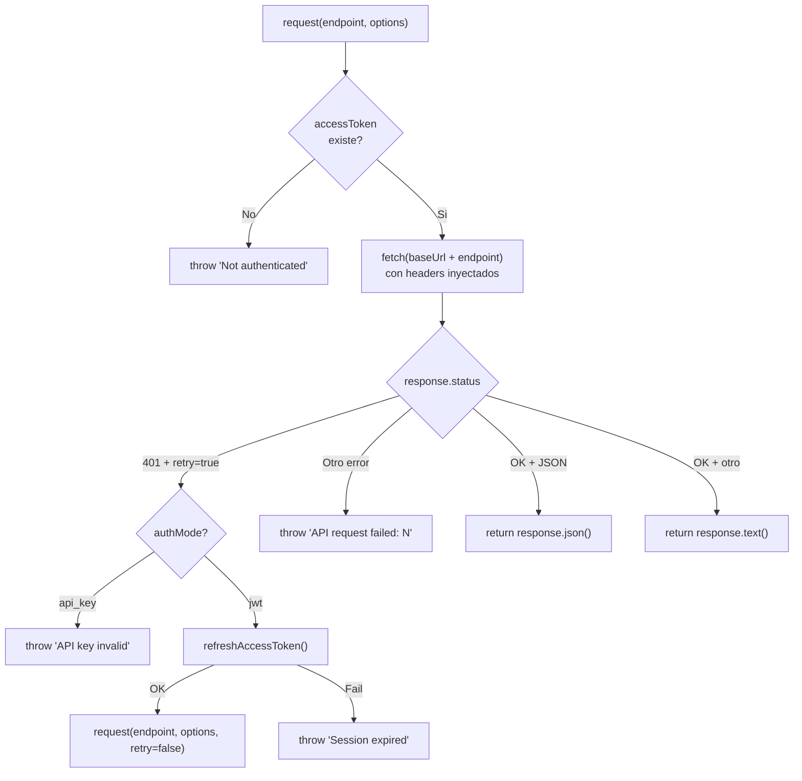
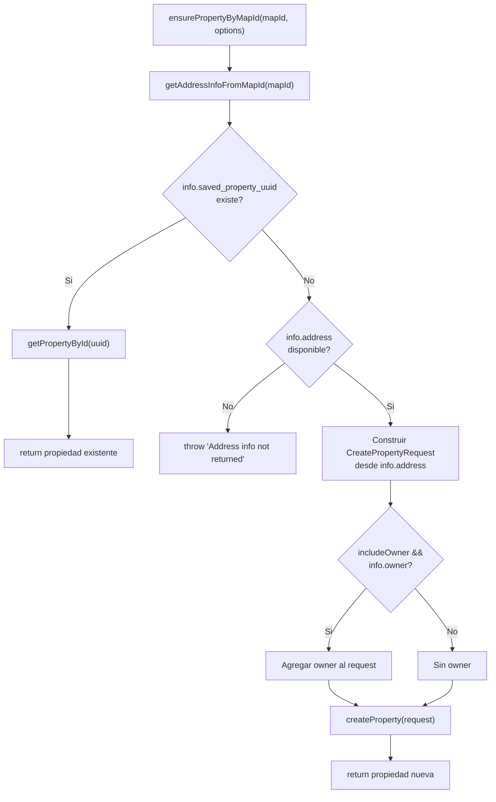

# SDK Map — @dsanchez.co/reisift-sdk

> **Version documented:** 0.2.0
> **Last updated:** 2026-02-17
> **Package name:** `@dsanchez.co/reisift-sdk`

---

## 1. Vision general

Este SDK es un cliente TypeScript **no oficial** para la API de [REISift](https://www.reisift.io) (plataforma de gestion de propiedades para inversores inmobiliarios). Fue construido mediante **reverse engineering** de la web app de REISift (capturas HAR) y documentacion publica limitada.

**Que es:**
- Un wrapper tipado sobre los endpoints HTTP descubiertos de REISift.
- Un punto de entrada unico (`ReisiftClient`) con autenticacion, paginacion y manejo de errores.

**Que NO es:**
- No es un SDK oficial de REISift.
- No cubre todos los endpoints de la plataforma; solo los descubiertos y verificados.
- No garantiza estabilidad ante cambios de la API privada de REISift.

---

## 2. Estructura del repositorio

```
sdk/
├── src/                                    # Codigo fuente
│   ├── index.ts                            # Entry point publico (barrel file)
│   ├── infrastructure/                     # Implementacion interna
│   │   ├── index.ts                        # Re-export
│   │   └── services/
│   │       ├── index.ts                    # Re-export
│   │       └── reisift-client.ts           # Clase principal ReisiftClient
│   ├── external/                           # Contratos publicos (interfaces y tipos)
│   │   ├── index.ts                        # Re-export
│   │   └── api/
│   │       ├── index.ts                    # Re-export
│   │       ├── client.interface.ts         # ReisiftClientInterface
│   │       ├── types.ts                    # Todos los tipos de la API
│   │       └── types/
│   │           └── index.ts                # Re-export de tipos
│   └── shared/                             # Utilidades compartidas
│       ├── index.ts                        # Re-export
│       └── logger.ts                       # Sistema de logging
├── scripts/                                # Scripts de desarrollo
│   ├── smoke-test.ts                       # Test de verificacion del SDK
│   └── parse-har.ts                        # Parser de capturas HAR
├── docs/                                   # Documentacion
│   ├── sdk-map.md                          # <-- ESTE ARCHIVO
│   ├── api-mapping/                        # Documentacion tecnica de API
│   │   ├── auth.md                         # Flujo de autenticacion descubierto
│   │   ├── extracted-endpoints.md          # Endpoints extraidos de HAR
│   │   ├── endpoints.md                    # Definiciones de tipos
│   │   └── endpoints.json                  # Definiciones de tipos (duplicado)
│   └── launch/                             # Material de lanzamiento (no trackeado)
│       └── copywriter-context.md           # Contexto para copywriting
├── dist/                                   # Build output (generado, no trackeado)
├── package.json                            # Manifiesto del paquete
├── tsconfig.json                           # Config base TypeScript
├── tsconfig.build.json                     # Config de build (excluye tests)
├── tsconfig.scripts.json                   # Config para scripts/
└── README.md                               # Documentacion principal
```

**Capas de arquitectura:**

| Capa | Carpeta | Responsabilidad |
|------|---------|-----------------|
| **External** | `src/external/` | Contratos publicos: interfaces y tipos que representan la API de REISift |
| **Infrastructure** | `src/infrastructure/` | Implementacion: clase `ReisiftClient` con auth, HTTP, y logica de negocio |
| **Shared** | `src/shared/` | Utilidades: logger configurable por niveles |

---

## 3. API publica (exports desde `src/index.ts`)

### 3.1 Clase principal

| Export | Tipo | Origen |
|--------|------|--------|
| `ReisiftClient` | class | `src/infrastructure/services/reisift-client.ts` |

### 3.2 Tipos del cliente

| Export | Tipo | Origen |
|--------|------|--------|
| `ReisiftClientConfig` | interface | `src/infrastructure/services/reisift-client.ts` |
| `ReisiftClientInterface` | interface | `src/external/api/client.interface.ts` |

### 3.3 Tipos de la API

Todos definidos en `src/external/api/types.ts`:

| Export | Descripcion |
|--------|-------------|
| `UserResponse` | Usuario autenticado |
| `Property` | Propiedad inmobiliaria |
| `PropertyAddress` | Direccion de propiedad |
| `PropertyOwner` | Propietario (con phones, emails) |
| `PropertySearchRequest` | Request de busqueda (limit, offset, ordering, query) |
| `PropertySearchResponse` | Respuesta paginada de busqueda |
| `PropertyImage` | Imagen de propiedad |
| `PropertyImagesResponse` | Respuesta paginada de imagenes |
| `PropertyOffer` | Oferta sobre propiedad |
| `PropertyOffersResponse` | Respuesta paginada de ofertas |
| `DashboardResponse` | Datos del dashboard |
| `DashboardGeneralResponse` | Estadisticas generales del dashboard |
| `SearchAutocompleteResult` | Resultado individual de autocomplete |
| `SearchAutocompleteResponse` | Array de resultados de autocomplete |
| `AddressInfoFromMapIdResponse` | Info detallada de direccion/propietario desde map ID |
| `MapIdAddress` | Estructura de direccion desde map ID |
| `MapIdOwner` | Estructura de propietario desde map ID |
| `CreatePropertyAddress` | Direccion para crear propiedad |
| `CreatePropertyOwner` | Propietario para crear propiedad |
| `CreatePropertyRequest` | Payload para crear propiedad |
| `EnsurePropertyOptions` | Opciones para `ensurePropertyByMapId()` |
| `ApiError` | Error estructurado de la API |
| `Pagination` | Parametros de paginacion genericos |
| `PaginatedResponse<T>` | Respuesta paginada generica |

### 3.4 Logger

| Export | Tipo | Origen |
|--------|------|--------|
| `logger` | const (Logger) | `src/shared/logger.ts` |
| `Logger` | interface | `src/shared/logger.ts` |
| `LogContext` | interface | `src/shared/logger.ts` |

### 3.5 Tipos internos (NO exportados publicamente)

Estos tipos se usan internamente pero no se exponen desde `src/index.ts`:

| Tipo | Origen | Uso |
|------|--------|-----|
| `LoginRequest` | `types.ts` | Payload de login (email/password) |
| `TokenPair` | `types.ts` | Par access/refresh del login |
| `RefreshRequest` | `types.ts` | Payload de refresh |
| `RefreshResponse` | `types.ts` | Respuesta del refresh |
| `PropertySearchQuery` | `types.ts` | Query con must/must_not/should |
| `SearchAutocompleteRequest` | `types.ts` | Payload de autocomplete |
| `AddressInfoFromMapIdRequest` | `types.ts` | Payload de address-info-from-map-id |
| `AuthMode` | `reisift-client.ts` | `'none' \| 'api_key' \| 'jwt'` |

---

## 4. Dominios funcionales

### 4.1 Authentication

**Archivos:** `reisift-client.ts` (metodos), `types.ts` (tipos)

| Metodo | Visibilidad | Descripcion |
|--------|-------------|-------------|
| `authenticate()` | public | Punto de entrada unico. Detecta modo (API key vs email/password) |
| `authenticateWithApiKey(apiKey)` | private | Usa apiKey como Bearer, valida con `getCurrentUser()` |
| `authenticateWithEmailPassword(email, password)` | private | POST a `/api/token/`, almacena access + refresh tokens |
| `refreshAccessToken()` | private | POST a `/api/token/refresh/`, re-intenta con nuevo access token |
| `isAuthenticated` | public (getter) | `true` si hay accessToken en memoria |
| `getTokens()` | public | Devuelve `{ accessToken, refreshToken }` |
| `getAccessToken()` | public | Devuelve solo el access token |

**Endpoints usados:**
- `POST /api/token/` -- Login con email/password
- `POST /api/token/refresh/` -- Refresh de access token

### 4.2 HTTP Client (request engine)

**Archivos:** `reisift-client.ts`

| Metodo | Visibilidad | Descripcion |
|--------|-------------|-------------|
| `request<T>(endpoint, options?, retryOnUnauthorized?)` | protected | Motor HTTP central. Agrega headers, maneja 401/refresh |

**Headers inyectados automaticamente:**
- `Authorization: Bearer {accessToken}`
- `Content-Type: application/json`
- `x-reisift-ui-version: 2022.02.01.7`

**Hosts:**
- API principal: `https://apiv2.reisift.io` (configurable via `baseUrl` / `REISIFT_BASE_URL`)
- Servicio de mapas: `https://map.reisift.io` (hardcoded, solo para `searchAutocomplete`)

### 4.3 User

**Archivos:** `reisift-client.ts`

| Metodo | Endpoint | Descripcion |
|--------|----------|-------------|
| `getCurrentUser()` | `GET /api/internal/user/` | Obtiene usuario autenticado. Tambien valida API keys |

### 4.4 Dashboard

**Archivos:** `reisift-client.ts`

| Metodo | Endpoint | Descripcion |
|--------|----------|-------------|
| `getDashboard()` | `GET /api/internal/dashboard/` | Datos del dashboard |
| `getDashboardGeneral()` | `GET /api/internal/dashboard/general/` | Estadisticas generales |

### 4.5 Properties (CRUD + Search)

**Archivos:** `reisift-client.ts`, `types.ts`

| Metodo | Endpoint | HTTP | Descripcion |
|--------|----------|------|-------------|
| `searchProperties(request?)` | `/api/internal/property/` | POST (con `x-http-method-override: GET`) | Busqueda con filtros, paginacion, ordenamiento |
| `getPropertyById(uuid)` | `/api/internal/property/{uuid}/` | GET | Propiedad por UUID |
| `getPropertyImages(uuid)` | `/api/internal/property/{uuid}/image/` | GET | Imagenes de una propiedad |
| `getPropertyOffers(uuid)` | `/api/internal/property/{uuid}/offer/` | GET | Ofertas de una propiedad |
| `createProperty(request)` | `/api/internal/property/` | POST | Crear nueva propiedad |
| `ensurePropertyByMapId(mapId, options?)` | (compuesto) | -- | Workflow: busca por mapId, retorna existente o crea nueva |

**Nota sobre `searchProperties`:** Usa `POST` con header `x-http-method-override: GET`, un patron no convencional que REISift usa para enviar queries complejas como body.

**Defaults de `searchProperties`:**
- `limit`: 10
- `offset`: 0
- `ordering`: `-list_count`
- `query`: `{ must: { property_type: 'clean' } }`

### 4.6 Map / Geocoding

**Archivos:** `reisift-client.ts`, `types.ts`

| Metodo | Endpoint | Host | Descripcion |
|--------|----------|------|-------------|
| `searchAutocomplete(search)` | `POST /properties/search-autocomplete/` | `map.reisift.io` | Autocomplete de direcciones |
| `getAddressInfoFromMapId(mapId)` | `POST /api/internal/property/address-info-from-map-id/` | `apiv2.reisift.io` | Info detallada de direccion + propietario desde map ID |

**Nota:** `searchAutocomplete` no usa el metodo `request()` generico; hace su propio `fetch` directo a `map.reisift.io`.

### 4.7 Error Handling

- Errores HTTP se lanzan como `Error` con formato: `"API request failed: {status} {statusText} - {body}"`.
- En 401: si modo es `api_key`, error inmediato. Si modo es `jwt`, intenta refresh y re-ejecuta una vez.
- Tipo `ApiError` exportado para uso del consumidor (no instanciado internamente).

### 4.8 Logger

**Archivos:** `src/shared/logger.ts`

| Metodo | Descripcion |
|--------|-------------|
| `logger.debug(msg, context?)` | Solo con `LOG_LEVEL=debug` |
| `logger.info(msg, context?)` | Default y superior |
| `logger.warn(msg, context?)` | Warnings |
| `logger.error(msg, error?, context?)` | Errores (incluye stack trace) |

**Formato de salida:** `[{ISO timestamp}] [{LEVEL}] {message} {JSON context}`

**Configuracion:** Variable de entorno `LOG_LEVEL` (valores: `debug`, `info`, `warn`, `error`; default: `info`).

### 4.9 Configuration

**Interface `ReisiftClientConfig`:**

| Campo | Tipo | Default | Descripcion |
|-------|------|---------|-------------|
| `baseUrl?` | string | `https://apiv2.reisift.io` | URL base de la API |
| `email?` | string | `REISIFT_EMAIL` env | Email para login |
| `password?` | string | `REISIFT_PASSWORD` env | Password para login |
| `apiKey?` | string | `REISIFT_API_KEY` env | API key (prioridad sobre email/password) |

**Variables de entorno:**

| Variable | Descripcion |
|----------|-------------|
| `REISIFT_API_KEY` | API key (prioridad) |
| `REISIFT_EMAIL` | Email para login |
| `REISIFT_PASSWORD` | Password para login |
| `REISIFT_BASE_URL` | URL base (default: `https://apiv2.reisift.io`) |
| `LOG_LEVEL` | Nivel de logging (default: `info`) |

---

## 5. Flujos clave

### 5.1 authenticate()


### 5.2 request() — Motor HTTP con retry en 401



### 5.3 ensurePropertyByMapId() — Workflow compuesto



---

## 6. Mapa de endpoints implementados

| Metodo del SDK | HTTP | Endpoint | Host |
|----------------|------|----------|------|
| `authenticate` (JWT) | POST | `/api/token/` | apiv2.reisift.io |
| `refreshAccessToken` | POST | `/api/token/refresh/` | apiv2.reisift.io |
| `getCurrentUser` | GET | `/api/internal/user/` | apiv2.reisift.io |
| `getDashboard` | GET | `/api/internal/dashboard/` | apiv2.reisift.io |
| `getDashboardGeneral` | GET | `/api/internal/dashboard/general/` | apiv2.reisift.io |
| `searchProperties` | POST* | `/api/internal/property/` | apiv2.reisift.io |
| `getPropertyById` | GET | `/api/internal/property/{uuid}/` | apiv2.reisift.io |
| `getPropertyImages` | GET | `/api/internal/property/{uuid}/image/` | apiv2.reisift.io |
| `getPropertyOffers` | GET | `/api/internal/property/{uuid}/offer/` | apiv2.reisift.io |
| `createProperty` | POST | `/api/internal/property/` | apiv2.reisift.io |
| `searchAutocomplete` | POST | `/properties/search-autocomplete/` | map.reisift.io |
| `getAddressInfoFromMapId` | POST | `/api/internal/property/address-info-from-map-id/` | apiv2.reisift.io |

\* `searchProperties` usa POST con header `x-http-method-override: GET`.

---

## 7. Build, scripts y tooling

### Compilacion

- **Build tool:** TypeScript Compiler (`tsc`) -- sin bundlers.
- **Target:** ES2022, module `NodeNext`.
- **Output:** `dist/` (JS + `.d.ts` + source maps).
- **Engine:** Node >= 18.

### Scripts (package.json)

| Script | Comando | Descripcion |
|--------|---------|-------------|
| `build` | `tsc -p tsconfig.build.json` | Compila a `dist/` |
| `build:check` | `tsc --noEmit` | Type-check sin emitir |
| `typecheck` | `tsc --noEmit && tsc -p tsconfig.scripts.json --noEmit` | Verifica src + scripts |
| `typecheck:src` | `tsc --noEmit` | Solo src |
| `typecheck:scripts` | `tsc -p tsconfig.scripts.json --noEmit` | Solo scripts/ |
| `prepublishOnly` | `npm run build` | Auto-build antes de publicar |
| `smoke-test` | `tsx scripts/smoke-test.ts` | Test de humo con credenciales reales |
| `parse-har` | `tsx scripts/parse-har.ts` | Parser de archivos HAR para descubrir endpoints |

### Configs TypeScript

| Archivo | Proposito |
|---------|-----------|
| `tsconfig.json` | Config base (ES2022, NodeNext, strict, declarations) |
| `tsconfig.build.json` | Extiende base, excluye tests |
| `tsconfig.scripts.json` | Para `scripts/`, sin emision |

### Dependencias

| Paquete | Tipo | Uso |
|---------|------|-----|
| `typescript` ^5.5.0 | dev | Compilador |
| `tsx` ^4.7.0 | dev | Ejecucion directa de TS (scripts) |
| `dotenv` ^17.2.3 | dev | Variables de entorno en scripts |
| `@types/node` ^22.0.0 | dev | Tipos de Node.js |

> **Nota:** No hay dependencias de produccion. El SDK usa `fetch` nativo (Node 18+).

---

## 8. Inventario de documentacion existente

| Archivo | Contenido | Estado |
|---------|-----------|--------|
| `README.md` | Quick start, auth, config, API reference, tipos, desarrollo | Trackeado |
| `docs/sdk-map.md` | Este documento | Trackeado |
| `docs/api-mapping/auth.md` | Flujo JWT descubierto (RS512, tokens, headers, expiracion) | Trackeado |
| `docs/api-mapping/extracted-endpoints.md` | Endpoints extraidos de HAR | Trackeado, **contiene PII** |
| `docs/api-mapping/endpoints.md` | Definiciones de tipos TypeScript | Trackeado |
| `docs/api-mapping/endpoints.json` | Definiciones de tipos (duplicado) | Trackeado |
| `docs/launch/copywriter-context.md` | Contexto completo para copywriting de lanzamiento | **No trackeado** |

**No existentes:**
- CHANGELOG
- Carpeta `examples/`
- TypeDoc / documentacion generada

---

## 9. Sensitive / internal notes

> **ATENCION:** Este SDK fue construido por reverse engineering. Esta seccion documenta riesgos y como manejar informacion sensible.

### 9.1 Origen de los datos

Los endpoints y tipos fueron descubiertos mediante:
1. **Capturas HAR** de la web app de REISift (`app.reisift.io`).
2. **Inspeccion manual** de requests/responses.
3. **Prueba y error** con diferentes payloads.

### 9.2 Archivos con informacion sensible

| Archivo | Riesgo | Accion recomendada |
|---------|--------|--------------------|
| `docs/api-mapping/extracted-endpoints.md` | Contiene PII literal (emails, UUIDs de usuario, nombres) en query params | No publicar; sanitizar antes de compartir |
| `docs/api-mapping/endpoints.json` | Contiene tipos que pueden revelar estructura interna | Revisar antes de publicar |
| `docs/launch/copywriter-context.md` | Referencias a PII en archivos HAR | No trackeado; mantener fuera de git |
| `scripts/parse-har.ts` | Procesa HAR que puede contener credenciales | No incluir HARs en el repo |

### 9.3 Riesgos conocidos

- **Estabilidad de la API:** Los endpoints `/api/internal/*` son API privada de REISift. Pueden cambiar sin previo aviso.
- **Header `x-reisift-ui-version`:** Actualmente hardcoded como `2022.02.01.7`. Si REISift empieza a validarlo estrictamente, podria romper el SDK.
- **Tokens en memoria:** Access/refresh tokens se almacenan en memoria, no se persisten. Esto es intencional por seguridad, pero requiere re-autenticacion en cada sesion.
- **Rate limiting:** No se ha descubierto rate limiting, pero podria existir. El SDK no implementa backoff/retry (salvo el 401).
- **Logging de PII:** El logger puede imprimir datos sensibles si se usa con `LOG_LEVEL=debug`. Revisar antes de habilitar en produccion.

### 9.4 Endpoints descubiertos pero NO implementados

Los siguientes endpoints fueron observados en HAR pero no estan implementados en el SDK:

| Endpoint | Metodo | Servicio | Notas |
|----------|--------|----------|-------|
| `/notification/unread_count/` | GET | apiv2.reisift.io | Conteo de notificaciones |
| `/checkNPSShow` | GET | Tercero (NPS widget) | Widget de NPS, no core |
| `/npsWidget` | GET | Tercero | Widget de NPS, no core |
| `/g/collect` | POST | Google Analytics | Tracking, no relevante |
