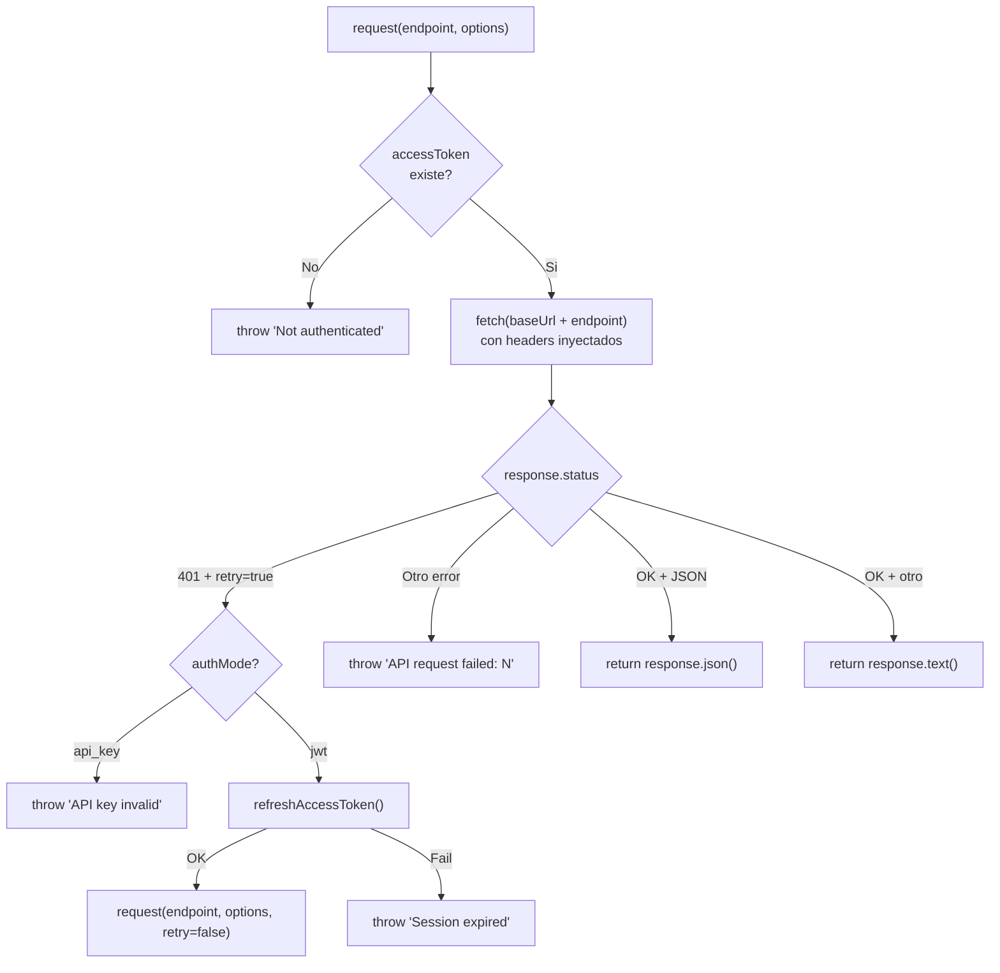
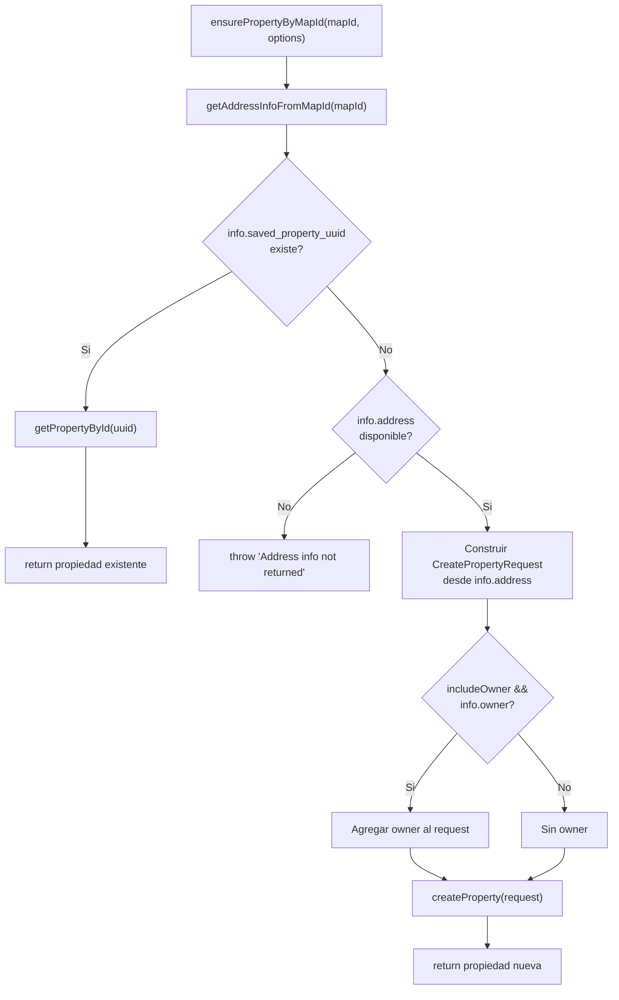
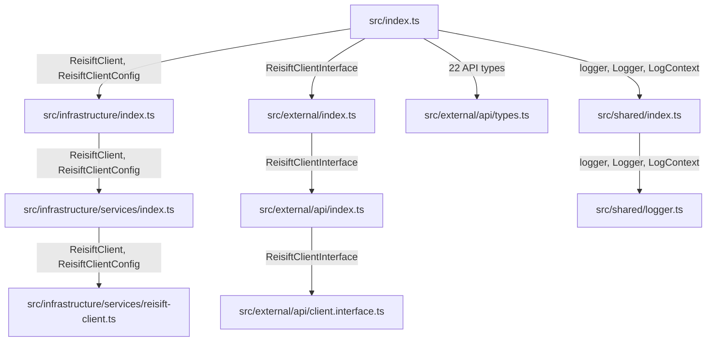

# SDK Map — @dsanchez.co/reisift-sdk

> **Version documented:** 0.2.0
> **Last updated:** 2026-02-17 (appendices A-G added)
> **Package name:** `@dsanchez.co/reisift-sdk`

---

## 1. Vision general

Este SDK es un cliente TypeScript **no oficial** para la API de [REISift](https://www.reisift.io) (plataforma de gestion de propiedades para inversores inmobiliarios). Fue construido mediante **reverse engineering** de la web app de REISift (capturas HAR) y documentacion publica limitada.

**Que es:**
- Un wrapper tipado sobre los endpoints HTTP descubiertos de REISift.
- Un punto de entrada unico (`ReisiftClient`) con autenticacion, paginacion y manejo de errores.

**Que NO es:**
- No es un SDK oficial de REISift.
- No cubre todos los endpoints de la plataforma; solo los descubiertos y verificados.
- No garantiza estabilidad ante cambios de la API privada de REISift.

---

## 2. Estructura del repositorio

```
sdk/
├── src/                                    # Codigo fuente
│   ├── index.ts                            # Entry point publico (barrel file)
│   ├── infrastructure/                     # Implementacion interna
│   │   ├── index.ts                        # Re-export
│   │   └── services/
│   │       ├── index.ts                    # Re-export
│   │       └── reisift-client.ts           # Clase principal ReisiftClient
│   ├── external/                           # Contratos publicos (interfaces y tipos)
│   │   ├── index.ts                        # Re-export
│   │   └── api/
│   │       ├── index.ts                    # Re-export
│   │       ├── client.interface.ts         # ReisiftClientInterface
│   │       ├── types.ts                    # Todos los tipos de la API
│   │       └── types/
│   │           └── index.ts                # Re-export de tipos
│   └── shared/                             # Utilidades compartidas
│       ├── index.ts                        # Re-export
│       └── logger.ts                       # Sistema de logging
├── scripts/                                # Scripts de desarrollo
│   ├── smoke-test.ts                       # Test de verificacion del SDK
│   └── parse-har.ts                        # Parser de capturas HAR
├── docs/                                   # Documentacion
│   ├── sdk-map.md                          # <-- ESTE ARCHIVO
│   ├── api-mapping/                        # Documentacion tecnica de API
│   │   ├── auth.md                         # Flujo de autenticacion descubierto
│   │   ├── extracted-endpoints.md          # Endpoints extraidos de HAR
│   │   ├── endpoints.md                    # Definiciones de tipos
│   │   └── endpoints.json                  # Definiciones de tipos (duplicado)
│   └── launch/                             # Material de lanzamiento (no trackeado)
│       └── copywriter-context.md           # Contexto para copywriting
├── dist/                                   # Build output (generado, no trackeado)
├── package.json                            # Manifiesto del paquete
├── tsconfig.json                           # Config base TypeScript
├── tsconfig.build.json                     # Config de build (excluye tests)
├── tsconfig.scripts.json                   # Config para scripts/
└── README.md                               # Documentacion principal
```

**Capas de arquitectura:**

| Capa | Carpeta | Responsabilidad |
|------|---------|-----------------|
| **External** | `src/external/` | Contratos publicos: interfaces y tipos que representan la API de REISift |
| **Infrastructure** | `src/infrastructure/` | Implementacion: clase `ReisiftClient` con auth, HTTP, y logica de negocio |
| **Shared** | `src/shared/` | Utilidades: logger configurable por niveles |

---

## 3. API publica (exports desde `src/index.ts`)

### 3.1 Clase principal

| Export | Tipo | Origen |
|--------|------|--------|
| `ReisiftClient` | class | `src/infrastructure/services/reisift-client.ts` |

### 3.2 Tipos del cliente

| Export | Tipo | Origen |
|--------|------|--------|
| `ReisiftClientConfig` | interface | `src/infrastructure/services/reisift-client.ts` |
| `ReisiftClientInterface` | interface | `src/external/api/client.interface.ts` |

### 3.3 Tipos de la API

Todos definidos en `src/external/api/types.ts`:

| Export | Descripcion |
|--------|-------------|
| `UserResponse` | Usuario autenticado |
| `Property` | Propiedad inmobiliaria |
| `PropertyAddress` | Direccion de propiedad |
| `PropertyOwner` | Propietario (con phones, emails) |
| `PropertySearchRequest` | Request de busqueda (limit, offset, ordering, query) |
| `PropertySearchResponse` | Respuesta paginada de busqueda |
| `PropertyImage` | Imagen de propiedad |
| `PropertyImagesResponse` | Respuesta paginada de imagenes |
| `PropertyOffer` | Oferta sobre propiedad |
| `PropertyOffersResponse` | Respuesta paginada de ofertas |
| `DashboardResponse` | Datos del dashboard |
| `DashboardGeneralResponse` | Estadisticas generales del dashboard |
| `SearchAutocompleteResult` | Resultado individual de autocomplete |
| `SearchAutocompleteResponse` | Array de resultados de autocomplete |
| `AddressInfoFromMapIdResponse` | Info detallada de direccion/propietario desde map ID |
| `MapIdAddress` | Estructura de direccion desde map ID |
| `MapIdOwner` | Estructura de propietario desde map ID |
| `CreatePropertyAddress` | Direccion para crear propiedad |
| `CreatePropertyOwner` | Propietario para crear propiedad |
| `CreatePropertyRequest` | Payload para crear propiedad |
| `EnsurePropertyOptions` | Opciones para `ensurePropertyByMapId()` |
| `ApiError` | Error estructurado de la API |
| `Pagination` | Parametros de paginacion genericos |
| `PaginatedResponse<T>` | Respuesta paginada generica |

### 3.4 Logger

| Export | Tipo | Origen |
|--------|------|--------|
| `logger` | const (Logger) | `src/shared/logger.ts` |
| `Logger` | interface | `src/shared/logger.ts` |
| `LogContext` | interface | `src/shared/logger.ts` |

### 3.5 Tipos internos (NO exportados publicamente)

Estos tipos se usan internamente pero no se exponen desde `src/index.ts`:

| Tipo | Origen | Uso |
|------|--------|-----|
| `LoginRequest` | `types.ts` | Payload de login (email/password) |
| `TokenPair` | `types.ts` | Par access/refresh del login |
| `RefreshRequest` | `types.ts` | Payload de refresh |
| `RefreshResponse` | `types.ts` | Respuesta del refresh |
| `PropertySearchQuery` | `types.ts` | Query con must/must_not/should |
| `SearchAutocompleteRequest` | `types.ts` | Payload de autocomplete |
| `AddressInfoFromMapIdRequest` | `types.ts` | Payload de address-info-from-map-id |
| `AuthMode` | `reisift-client.ts` | `'none' \| 'api_key' \| 'jwt'` |

---

## 4. Dominios funcionales

### 4.1 Authentication

**Archivos:** `reisift-client.ts` (metodos), `types.ts` (tipos)

| Metodo | Visibilidad | Descripcion |
|--------|-------------|-------------|
| `authenticate()` | public | Punto de entrada unico. Detecta modo (API key vs email/password) |
| `authenticateWithApiKey(apiKey)` | private | Usa apiKey como Bearer, valida con `getCurrentUser()` |
| `authenticateWithEmailPassword(email, password)` | private | POST a `/api/token/`, almacena access + refresh tokens |
| `refreshAccessToken()` | private | POST a `/api/token/refresh/`, re-intenta con nuevo access token |
| `isAuthenticated` | public (getter) | `true` si hay accessToken en memoria |
| `getTokens()` | public | Devuelve `{ accessToken, refreshToken }` |
| `getAccessToken()` | public | Devuelve solo el access token |

**Endpoints usados:**
- `POST /api/token/` -- Login con email/password
- `POST /api/token/refresh/` -- Refresh de access token

### 4.2 HTTP Client (request engine)

**Archivos:** `reisift-client.ts`

| Metodo | Visibilidad | Descripcion |
|--------|-------------|-------------|
| `request<T>(endpoint, options?, retryOnUnauthorized?)` | protected | Motor HTTP central. Agrega headers, maneja 401/refresh |

**Headers inyectados automaticamente:**
- `Authorization: Bearer {accessToken}`
- `Content-Type: application/json`
- `x-reisift-ui-version: 2022.02.01.7`

**Hosts:**
- API principal: `https://apiv2.reisift.io` (configurable via `baseUrl` / `REISIFT_BASE_URL`)
- Servicio de mapas: `https://map.reisift.io` (hardcoded, solo para `searchAutocomplete`)

### 4.3 User

**Archivos:** `reisift-client.ts`

| Metodo | Endpoint | Descripcion |
|--------|----------|-------------|
| `getCurrentUser()` | `GET /api/internal/user/` | Obtiene usuario autenticado. Tambien valida API keys |

### 4.4 Dashboard

**Archivos:** `reisift-client.ts`

| Metodo | Endpoint | Descripcion |
|--------|----------|-------------|
| `getDashboard()` | `GET /api/internal/dashboard/` | Datos del dashboard |
| `getDashboardGeneral()` | `GET /api/internal/dashboard/general/` | Estadisticas generales |

### 4.5 Properties (CRUD + Search)

**Archivos:** `reisift-client.ts`, `types.ts`

| Metodo | Endpoint | HTTP | Descripcion |
|--------|----------|------|-------------|
| `searchProperties(request?)` | `/api/internal/property/` | POST (con `x-http-method-override: GET`) | Busqueda con filtros, paginacion, ordenamiento |
| `getPropertyById(uuid)` | `/api/internal/property/{uuid}/` | GET | Propiedad por UUID |
| `getPropertyImages(uuid)` | `/api/internal/property/{uuid}/image/` | GET | Imagenes de una propiedad |
| `getPropertyOffers(uuid)` | `/api/internal/property/{uuid}/offer/` | GET | Ofertas de una propiedad |
| `createProperty(request)` | `/api/internal/property/` | POST | Crear nueva propiedad |
| `ensurePropertyByMapId(mapId, options?)` | (compuesto) | -- | Workflow: busca por mapId, retorna existente o crea nueva |

**Nota sobre `searchProperties`:** Usa `POST` con header `x-http-method-override: GET`, un patron no convencional que REISift usa para enviar queries complejas como body.

**Defaults de `searchProperties`:**
- `limit`: 10
- `offset`: 0
- `ordering`: `-list_count`
- `query`: `{ must: { property_type: 'clean' } }`

### 4.6 Map / Geocoding

**Archivos:** `reisift-client.ts`, `types.ts`

| Metodo | Endpoint | Host | Descripcion |
|--------|----------|------|-------------|
| `searchAutocomplete(search)` | `POST /properties/search-autocomplete/` | `map.reisift.io` | Autocomplete de direcciones |
| `getAddressInfoFromMapId(mapId)` | `POST /api/internal/property/address-info-from-map-id/` | `apiv2.reisift.io` | Info detallada de direccion + propietario desde map ID |

**Nota:** `searchAutocomplete` no usa el metodo `request()` generico; hace su propio `fetch` directo a `map.reisift.io`.

### 4.7 Error Handling

- Errores HTTP se lanzan como `Error` con formato: `"API request failed: {status} {statusText} - {body}"`.
- En 401: si modo es `api_key`, error inmediato. Si modo es `jwt`, intenta refresh y re-ejecuta una vez.
- Tipo `ApiError` exportado para uso del consumidor (no instanciado internamente).

### 4.8 Logger

**Archivos:** `src/shared/logger.ts`

| Metodo | Descripcion |
|--------|-------------|
| `logger.debug(msg, context?)` | Solo con `LOG_LEVEL=debug` |
| `logger.info(msg, context?)` | Default y superior |
| `logger.warn(msg, context?)` | Warnings |
| `logger.error(msg, error?, context?)` | Errores (incluye stack trace) |

**Formato de salida:** `[{ISO timestamp}] [{LEVEL}] {message} {JSON context}`

**Configuracion:** Variable de entorno `LOG_LEVEL` (valores: `debug`, `info`, `warn`, `error`; default: `info`).

### 4.9 Configuration

**Interface `ReisiftClientConfig`:**

| Campo | Tipo | Default | Descripcion |
|-------|------|---------|-------------|
| `baseUrl?` | string | `https://apiv2.reisift.io` | URL base de la API |
| `email?` | string | `REISIFT_EMAIL` env | Email para login |
| `password?` | string | `REISIFT_PASSWORD` env | Password para login |
| `apiKey?` | string | `REISIFT_API_KEY` env | API key (prioridad sobre email/password) |

**Variables de entorno:**

| Variable | Descripcion |
|----------|-------------|
| `REISIFT_API_KEY` | API key (prioridad) |
| `REISIFT_EMAIL` | Email para login |
| `REISIFT_PASSWORD` | Password para login |
| `REISIFT_BASE_URL` | URL base (default: `https://apiv2.reisift.io`) |
| `LOG_LEVEL` | Nivel de logging (default: `info`) |

---

## 5. Flujos clave

### 5.1 authenticate()


### 5.2 request() — Motor HTTP con retry en 401



### 5.3 ensurePropertyByMapId() — Workflow compuesto



---

## 6. Mapa de endpoints implementados

| Metodo del SDK | HTTP | Endpoint | Host |
|----------------|------|----------|------|
| `authenticate` (JWT) | POST | `/api/token/` | apiv2.reisift.io |
| `refreshAccessToken` | POST | `/api/token/refresh/` | apiv2.reisift.io |
| `getCurrentUser` | GET | `/api/internal/user/` | apiv2.reisift.io |
| `getDashboard` | GET | `/api/internal/dashboard/` | apiv2.reisift.io |
| `getDashboardGeneral` | GET | `/api/internal/dashboard/general/` | apiv2.reisift.io |
| `searchProperties` | POST* | `/api/internal/property/` | apiv2.reisift.io |
| `getPropertyById` | GET | `/api/internal/property/{uuid}/` | apiv2.reisift.io |
| `getPropertyImages` | GET | `/api/internal/property/{uuid}/image/` | apiv2.reisift.io |
| `getPropertyOffers` | GET | `/api/internal/property/{uuid}/offer/` | apiv2.reisift.io |
| `createProperty` | POST | `/api/internal/property/` | apiv2.reisift.io |
| `searchAutocomplete` | POST | `/properties/search-autocomplete/` | map.reisift.io |
| `getAddressInfoFromMapId` | POST | `/api/internal/property/address-info-from-map-id/` | apiv2.reisift.io |

\* `searchProperties` usa POST con header `x-http-method-override: GET`.

---

## 7. Build, scripts y tooling

### Compilacion

- **Build tool:** TypeScript Compiler (`tsc`) -- sin bundlers.
- **Target:** ES2022, module `NodeNext`.
- **Output:** `dist/` (JS + `.d.ts` + source maps).
- **Engine:** Node >= 18.

### Scripts (package.json)

| Script | Comando | Descripcion |
|--------|---------|-------------|
| `build` | `tsc -p tsconfig.build.json` | Compila a `dist/` |
| `build:check` | `tsc --noEmit` | Type-check sin emitir |
| `typecheck` | `tsc --noEmit && tsc -p tsconfig.scripts.json --noEmit` | Verifica src + scripts |
| `typecheck:src` | `tsc --noEmit` | Solo src |
| `typecheck:scripts` | `tsc -p tsconfig.scripts.json --noEmit` | Solo scripts/ |
| `prepublishOnly` | `npm run build` | Auto-build antes de publicar |
| `smoke-test` | `tsx scripts/smoke-test.ts` | Test de humo con credenciales reales |
| `parse-har` | `tsx scripts/parse-har.ts` | Parser de archivos HAR para descubrir endpoints |

### Configs TypeScript

| Archivo | Proposito |
|---------|-----------|
| `tsconfig.json` | Config base (ES2022, NodeNext, strict, declarations) |
| `tsconfig.build.json` | Extiende base, excluye tests |
| `tsconfig.scripts.json` | Para `scripts/`, sin emision |

### Dependencias

| Paquete | Tipo | Uso |
|---------|------|-----|
| `typescript` ^5.5.0 | dev | Compilador |
| `tsx` ^4.7.0 | dev | Ejecucion directa de TS (scripts) |
| `dotenv` ^17.2.3 | dev | Variables de entorno en scripts |
| `@types/node` ^22.0.0 | dev | Tipos de Node.js |

> **Nota:** No hay dependencias de produccion. El SDK usa `fetch` nativo (Node 18+).

---

## 8. Inventario de documentacion existente

| Archivo | Contenido | Estado |
|---------|-----------|--------|
| `README.md` | Quick start, auth, config, API reference, tipos, desarrollo | Trackeado |
| `docs/sdk-map.md` | Este documento | Trackeado |
| `docs/api-mapping/auth.md` | Flujo JWT descubierto (RS512, tokens, headers, expiracion) | Trackeado |
| `docs/api-mapping/extracted-endpoints.md` | Endpoints extraidos de HAR | Trackeado, **contiene PII** |
| `docs/api-mapping/endpoints.md` | Definiciones de tipos TypeScript | Trackeado |
| `docs/api-mapping/endpoints.json` | Definiciones de tipos (duplicado) | Trackeado |
| `docs/launch/copywriter-context.md` | Contexto completo para copywriting de lanzamiento | **No trackeado** |

**No existentes:**
- CHANGELOG
- Carpeta `examples/`
- TypeDoc / documentacion generada

---

## 9. Sensitive / internal notes

> **ATENCION:** Este SDK fue construido por reverse engineering. Esta seccion documenta riesgos y como manejar informacion sensible.

### 9.1 Origen de los datos

Los endpoints y tipos fueron descubiertos mediante:
1. **Capturas HAR** de la web app de REISift (`app.reisift.io`).
2. **Inspeccion manual** de requests/responses.
3. **Prueba y error** con diferentes payloads.

### 9.2 Archivos con informacion sensible

| Archivo | Riesgo | Accion recomendada |
|---------|--------|--------------------|
| `docs/api-mapping/extracted-endpoints.md` | Contiene PII literal (emails, UUIDs de usuario, nombres) en query params | No publicar; sanitizar antes de compartir |
| `docs/api-mapping/endpoints.json` | Contiene tipos que pueden revelar estructura interna | Revisar antes de publicar |
| `docs/launch/copywriter-context.md` | Referencias a PII en archivos HAR | No trackeado; mantener fuera de git |
| `scripts/parse-har.ts` | Procesa HAR que puede contener credenciales | No incluir HARs en el repo |

### 9.3 Riesgos conocidos

- **Estabilidad de la API:** Los endpoints `/api/internal/*` son API privada de REISift. Pueden cambiar sin previo aviso.
- **Header `x-reisift-ui-version`:** Actualmente hardcoded como `2022.02.01.7`. Si REISift empieza a validarlo estrictamente, podria romper el SDK.
- **Tokens en memoria:** Access/refresh tokens se almacenan en memoria, no se persisten. Esto es intencional por seguridad, pero requiere re-autenticacion en cada sesion.
- **Rate limiting:** No se ha descubierto rate limiting, pero podria existir. El SDK no implementa backoff/retry (salvo el 401).
- **Logging de PII:** El logger puede imprimir datos sensibles si se usa con `LOG_LEVEL=debug`. Revisar antes de habilitar en produccion.

### 9.4 Endpoints descubiertos pero NO implementados

Los siguientes endpoints fueron observados en HAR pero no estan implementados en el SDK:

| Endpoint | Metodo | Servicio | Notas |
|----------|--------|----------|-------|
| `/notification/unread_count/` | GET | apiv2.reisift.io | Conteo de notificaciones |
| `/checkNPSShow` | GET | Tercero (NPS widget) | Widget de NPS, no core |
| `/npsWidget` | GET | Tercero | Widget de NPS, no core |
| `/g/collect` | POST | Google Analytics | Tracking, no relevante |

---

# APPENDICES — Inventario interno exhaustivo

> Lo que sigue es un desglose **linea por linea** de cada archivo fuente del SDK: constantes, campos, funciones, tipos, y artefactos auxiliares. Sirve como referencia interna completa.

---

## Appendix A — `ReisiftClient` (inventario completo)

**Archivo:** `src/infrastructure/services/reisift-client.ts` (383 lineas)

### A.1 Imports

| Import | Tipo | Origen |
|--------|------|--------|
| `ReisiftClientInterface` | type | `../../external/api/client.interface.js` |
| `TokenPair` | type | `../../external/api/types.js` |
| `LoginRequest` | type | `../../external/api/types.js` |
| `DashboardResponse` | type | `../../external/api/types.js` |
| `DashboardGeneralResponse` | type | `../../external/api/types.js` |
| `PropertySearchRequest` | type | `../../external/api/types.js` |
| `PropertySearchResponse` | type | `../../external/api/types.js` |
| `Property` | type | `../../external/api/types.js` |
| `PropertyImagesResponse` | type | `../../external/api/types.js` |
| `PropertyOffersResponse` | type | `../../external/api/types.js` |
| `SearchAutocompleteResponse` | type | `../../external/api/types.js` |
| `AddressInfoFromMapIdResponse` | type | `../../external/api/types.js` |
| `UserResponse` | type | `../../external/api/types.js` |
| `CreatePropertyRequest` | type | `../../external/api/types.js` |
| `EnsurePropertyOptions` | type | `../../external/api/types.js` |
| `logger` | value | `../../shared/logger.js` |

### A.2 Constantes de modulo (file-level)

| Constante | Tipo | Valor | Exportada | Notas |
|-----------|------|-------|-----------|-------|
| `DEFAULT_BASE_URL` | `string` | `'https://apiv2.reisift.io'` | No | Fallback si no hay config ni env |
| `MAP_BASE_URL` | `string` | `'https://map.reisift.io'` | No | Hardcoded; solo para `searchAutocomplete` |
| `UI_VERSION_HEADER` | `string` | `'2022.02.01.7'` | No | Inyectado en `x-reisift-ui-version` |

### A.3 Tipos locales (no exportados)

| Tipo | Definicion | Notas |
|------|------------|-------|
| `AuthMode` | `'none' \| 'api_key' \| 'jwt'` | Discrimina el modo de autenticacion activo |

### A.4 Interface exportada: `ReisiftClientConfig`

| Campo | Tipo | Requerido | Default (resolucion) | Descripcion |
|-------|------|-----------|----------------------|-------------|
| `baseUrl` | `string` | No | `config.baseUrl` -> `REISIFT_BASE_URL` -> `DEFAULT_BASE_URL` | URL base de la API |
| `email` | `string` | No | `config.email` -> `REISIFT_EMAIL` | Email para auth JWT |
| `password` | `string` | No | `config.password` -> `REISIFT_PASSWORD` | Password para auth JWT |
| `apiKey` | `string` | No | `config.apiKey` -> `REISIFT_API_KEY` | API key (prioridad sobre email/password) |

### A.5 Clase `ReisiftClient` — Campos de instancia

| Campo | Visibilidad | Tipo | Valor inicial | Mutable | Notas |
|-------|-------------|------|---------------|---------|-------|
| `config` | `private readonly` | `ReisiftClientConfig` | `config ?? {}` | No | Config pasada al constructor |
| `baseUrl` | `private readonly` | `string` | resuelto en constructor | No | Ver cadena de fallback en A.4 |
| `accessToken` | `private` | `string \| null` | `null` | Si | Se asigna en auth, se limpia en errores |
| `refreshToken` | `private` | `string \| null` | `null` | Si | Solo en modo JWT; null en modo api_key |
| `isRefreshing` | `private` | `boolean` | `false` | Si | Guard contra refresh concurrente |
| `authMode` | `private` | `AuthMode` | `'none'` | Si | Cambia en auth; reseteado a `'none'` en fallos |

### A.6 Constructor

```typescript
constructor(config?: ReisiftClientConfig)
```

**Comportamiento:**
1. `this.config = config ?? {}` — almacena config o objeto vacio.
2. `this.baseUrl` — resuelve en orden: `config.baseUrl` -> `process.env['REISIFT_BASE_URL']` -> `DEFAULT_BASE_URL`.
3. `logger.debug('ReisiftClient initialized', { baseUrl: this.baseUrl })` — log de inicializacion.

### A.7 Metodos — Inventario completo

#### `authenticate()` — public async

```typescript
async authenticate(): Promise<void>
```

| Aspecto | Detalle |
|---------|---------|
| **Visibilidad** | `public` |
| **Retorno** | `Promise<void>` |
| **Efectos secundarios** | Muta `accessToken`, `refreshToken`, `authMode` |
| **Puede lanzar** | `Error('Missing authentication credentials...')` si no hay credenciales |
| **Logica** | 1. Lee `apiKey` de config o env. Si existe -> delega a `authenticateWithApiKey(apiKey)`. 2. Lee `email`+`password` de config o env. Si existen -> delega a `authenticateWithEmailPassword(email, password)`. 3. Si ninguno -> throw. |

#### `authenticateWithApiKey(apiKey)` — private async

```typescript
private async authenticateWithApiKey(apiKey: string): Promise<void>
```

| Aspecto | Detalle |
|---------|---------|
| **Visibilidad** | `private` |
| **Parametros** | `apiKey: string` |
| **Efectos secundarios** | Asigna `accessToken = apiKey`, `authMode = 'api_key'`; resetea ambos en fallo |
| **Puede lanzar** | `Error('API key authentication failed: ...')` |
| **Logica** | 1. `logger.info(...)`. 2. Asigna token y modo. 3. Llama `this.getCurrentUser()` para validar. 4. Si OK -> `logger.info(...)`. 5. Si error -> resetea `accessToken = null`, `authMode = 'none'`, re-throws. |

#### `authenticateWithEmailPassword(email, password)` — private async

```typescript
private async authenticateWithEmailPassword(email: string, password: string): Promise<void>
```

| Aspecto | Detalle |
|---------|---------|
| **Visibilidad** | `private` |
| **Parametros** | `email: string`, `password: string` |
| **Endpoint** | `POST {baseUrl}/api/token/` |
| **Request body** | `LoginRequest { email, password, remember: true, agree: true }` |
| **Headers enviados** | `Content-Type: application/json` (sin auth — es login) |
| **Efectos secundarios** | Asigna `accessToken = tokens.access`, `refreshToken = tokens.refresh`, `authMode = 'jwt'` |
| **Puede lanzar** | `Error('Authentication failed: Login failed: {status} ...')` |
| **Logica** | 1. Construye `LoginRequest`. 2. `fetch(POST)`. 3. Si `!response.ok` -> throw con status+body. 4. Parsea JSON como `TokenPair`. 5. Almacena tokens. 6. Asigna `authMode = 'jwt'`. |

#### `getCurrentUser()` — public async

```typescript
async getCurrentUser(): Promise<UserResponse>
```

| Aspecto | Detalle |
|---------|---------|
| **Visibilidad** | `public` |
| **Retorno** | `Promise<UserResponse>` |
| **Endpoint** | `GET /api/internal/user/` (via `request()`) |
| **Uso doble** | Metodo publico + validacion interna de API key en `authenticateWithApiKey()` |

#### `refreshAccessToken()` — private async

```typescript
private async refreshAccessToken(): Promise<boolean>
```

| Aspecto | Detalle |
|---------|---------|
| **Visibilidad** | `private` |
| **Retorno** | `Promise<boolean>` — `true` si refresh exitoso, `false` si fallo |
| **Endpoint** | `POST {baseUrl}/api/token/refresh/` |
| **Request body** | `{ refresh: this.refreshToken }` |
| **Headers enviados** | `Content-Type: application/json` (sin Bearer — usa refresh token en body) |
| **Guards** | Retorna `false` inmediatamente si: (a) `authMode === 'api_key'`, (b) `!this.refreshToken`, (c) `this.isRefreshing === true` |
| **Efectos secundarios** | En exito: actualiza `accessToken` (y `refreshToken` si viene nuevo). En fallo HTTP: resetea `accessToken = null`, `refreshToken = null`, `authMode = 'none'`. Siempre: `this.isRefreshing = false` en `finally`. |
| **Puede lanzar** | No lanza; atrapa errores y retorna `false` |

#### `request<T>(endpoint, options?, retryOnUnauthorized?)` — protected async

```typescript
protected async request<T>(
  endpoint: string,
  options: RequestInit = {},
  retryOnUnauthorized = true
): Promise<T>
```

| Aspecto | Detalle |
|---------|---------|
| **Visibilidad** | `protected` (accesible a subclases) |
| **Generics** | `T` — tipo de retorno esperado |
| **Parametros** | `endpoint: string` (path relativo), `options: RequestInit` (default `{}`), `retryOnUnauthorized: boolean` (default `true`) |
| **URL construida** | `{this.baseUrl}{endpoint}` |
| **Headers inyectados** | `Content-Type: application/json`, `Authorization: Bearer {accessToken}`, `x-reisift-ui-version: {UI_VERSION_HEADER}`, luego spread de `options.headers` (permite override) |
| **Flujo de errores** | (1) Sin `accessToken` -> throw `'Not authenticated'`. (2) Status 401 + `retryOnUnauthorized=true`: si `api_key` -> throw `'API key invalid'`; si `jwt` -> intenta refresh, si OK recursion con `retry=false`, si fallo throw `'Session expired'`. (3) Otro error HTTP -> throw con status+body. |
| **Flujo de exito** | Si content-type incluye `application/json` -> `response.json() as T`. Si no -> `response.text() as unknown as T`. |

#### `isAuthenticated` — public getter

```typescript
get isAuthenticated(): boolean
```

| Aspecto | Detalle |
|---------|---------|
| **Visibilidad** | `public` (readonly getter) |
| **Retorno** | `this.accessToken !== null` |

#### `getTokens()` — public

```typescript
getTokens(): { accessToken: string | null; refreshToken: string | null }
```

| Aspecto | Detalle |
|---------|---------|
| **Visibilidad** | `public` |
| **Retorno** | Objeto con ambos tokens actuales |

#### `getAccessToken()` — public

```typescript
getAccessToken(): string | null
```

| Aspecto | Detalle |
|---------|---------|
| **Visibilidad** | `public` |
| **Retorno** | `this.accessToken` |

#### `getDashboard()` — public async

```typescript
async getDashboard(): Promise<DashboardResponse>
```

| Aspecto | Detalle |
|---------|---------|
| **Endpoint** | `GET /api/internal/dashboard/` (via `request()`) |

#### `getDashboardGeneral()` — public async

```typescript
async getDashboardGeneral(): Promise<DashboardGeneralResponse>
```

| Aspecto | Detalle |
|---------|---------|
| **Endpoint** | `GET /api/internal/dashboard/general/` (via `request()`) |

#### `searchProperties(request?)` — public async

```typescript
async searchProperties(request: PropertySearchRequest = {}): Promise<PropertySearchResponse>
```

| Aspecto | Detalle |
|---------|---------|
| **Parametro default** | `{}` |
| **Destructuring** | `{ limit = 10, offset = 0, ordering = '-list_count', query }` |
| **Endpoint** | `POST /api/internal/property/` (via `request()`) |
| **Headers extra** | `x-http-method-override: GET` |
| **Body** | `{ limit, offset, ordering, query: query ?? { must: { property_type: 'clean' } } }` |
| **Default query** | `{ must: { property_type: 'clean' } }` si no se pasa `query` |

#### `getPropertyById(uuid)` — public async

```typescript
async getPropertyById(uuid: string): Promise<Property>
```

| Aspecto | Detalle |
|---------|---------|
| **Endpoint** | `GET /api/internal/property/{uuid}/` (via `request()`) |

#### `getPropertyImages(uuid)` — public async

```typescript
async getPropertyImages(uuid: string): Promise<PropertyImagesResponse>
```

| Aspecto | Detalle |
|---------|---------|
| **Endpoint** | `GET /api/internal/property/{uuid}/image/?offset=0&limit=999` (via `request()`) |
| **Paginacion hardcoded** | `offset=0`, `limit=999` (fetches all) |

#### `getPropertyOffers(uuid)` — public async

```typescript
async getPropertyOffers(uuid: string): Promise<PropertyOffersResponse>
```

| Aspecto | Detalle |
|---------|---------|
| **Endpoint** | `GET /api/internal/property/{uuid}/offer/?offset=0&limit=999&ordering=-created` (via `request()`) |
| **Paginacion hardcoded** | `offset=0`, `limit=999`, `ordering=-created` |

#### `searchAutocomplete(search)` — public async

```typescript
async searchAutocomplete(search: string): Promise<SearchAutocompleteResponse>
```

| Aspecto | Detalle |
|---------|---------|
| **NO usa `request()`** | Hace `fetch` directo a `MAP_BASE_URL` |
| **URL** | `https://map.reisift.io/properties/search-autocomplete/` |
| **Headers** | `Content-Type: application/json`, `Authorization: Bearer {accessToken}`, `x-reisift-ui-version: {UI_VERSION_HEADER}` |
| **Body** | `{ search }` |
| **Guard** | Verifica `this.accessToken` antes; throw si null |
| **Response parsing** | Parsea como `{ data: SearchAutocompleteResponse }`, retorna `.data` |
| **Puede lanzar** | `Error('Not authenticated...')`, `Error('Search autocomplete failed: ...')` |

#### `getAddressInfoFromMapId(mapId)` — public async

```typescript
async getAddressInfoFromMapId(mapId: string): Promise<AddressInfoFromMapIdResponse>
```

| Aspecto | Detalle |
|---------|---------|
| **Endpoint** | `POST /api/internal/property/address-info-from-map-id/` (via `request()`) |
| **Body** | `{ map_id: mapId }` |

#### `createProperty(request)` — public async

```typescript
async createProperty(request: CreatePropertyRequest): Promise<Property>
```

| Aspecto | Detalle |
|---------|---------|
| **Endpoint** | `POST /api/internal/property/` (via `request()`) |
| **Body** | `JSON.stringify(request)` |
| **Logging** | `logger.debug('Creating property', { address: request.address })` |

#### `ensurePropertyByMapId(mapId, options?)` — public async

```typescript
async ensurePropertyByMapId(mapId: string, options: EnsurePropertyOptions = {}): Promise<Property>
```

| Aspecto | Detalle |
|---------|---------|
| **Metodos internos llamados** | `getAddressInfoFromMapId(mapId)`, `getPropertyById(uuid)` (si existe), `createProperty(request)` (si no existe) |
| **Parametro default** | `options = {}` |
| **Destructuring de options** | `{ includeOwner = true, ...createOptions }` |
| **Puede lanzar** | `Error('Address info not returned from map ID lookup')` si `!info.address` |
| **Logica de owner** | Si `includeOwner && info.owner` -> agrega `owner` al request. Si `info.owner.address` -> agrega `owner.address` tambien. |
| **Campos mapeados address** | `street`, `city`, `state`, `postal_code` (con fallback `?? ''`), `country` (sin fallback) |
| **Campos mapeados owner** | `first_name`, `last_name`, `company` |
| **Campos mapeados owner.address** | Igual que address principal |
| **createOptions spread** | `assigned_to`, `status`, `lists`, `tags`, `notes` se pasan directamente al `CreatePropertyRequest` |

### A.8 Tabla resumen: metodo -> endpoint -> headers extra -> errores posibles

| Metodo | HTTP | Endpoint | Host | Headers extra | Errores posibles |
|--------|------|----------|------|---------------|------------------|
| `authenticateWithEmailPassword` | POST | `/api/token/` | apiv2 | (ninguno extra) | `'Authentication failed: Login failed: ...'` |
| `refreshAccessToken` | POST | `/api/token/refresh/` | apiv2 | (ninguno extra) | (no lanza; retorna false) |
| `getCurrentUser` | GET | `/api/internal/user/` | apiv2 | (ninguno) | via `request()` |
| `getDashboard` | GET | `/api/internal/dashboard/` | apiv2 | (ninguno) | via `request()` |
| `getDashboardGeneral` | GET | `/api/internal/dashboard/general/` | apiv2 | (ninguno) | via `request()` |
| `searchProperties` | POST | `/api/internal/property/` | apiv2 | `x-http-method-override: GET` | via `request()` |
| `getPropertyById` | GET | `/api/internal/property/{uuid}/` | apiv2 | (ninguno) | via `request()` |
| `getPropertyImages` | GET | `/api/internal/property/{uuid}/image/` | apiv2 | (ninguno) | via `request()` |
| `getPropertyOffers` | GET | `/api/internal/property/{uuid}/offer/` | apiv2 | (ninguno) | via `request()` |
| `searchAutocomplete` | POST | `/properties/search-autocomplete/` | map | (ninguno extra) | `'Not authenticated...'`, `'Search autocomplete failed: ...'` |
| `getAddressInfoFromMapId` | POST | `/api/internal/property/address-info-from-map-id/` | apiv2 | (ninguno) | via `request()` |
| `createProperty` | POST | `/api/internal/property/` | apiv2 | (ninguno) | via `request()` |
| `ensurePropertyByMapId` | (compuesto) | (multiples) | apiv2 | (ninguno) | `'Address info not returned...'` + delegados |

---

## Appendix B — `ReisiftClientInterface`

**Archivo:** `src/external/api/client.interface.ts` (85 lineas)

### B.1 Imports (type-only)

`DashboardResponse`, `DashboardGeneralResponse`, `PropertySearchRequest`, `PropertySearchResponse`, `Property`, `PropertyImagesResponse`, `PropertyOffersResponse`, `SearchAutocompleteResponse`, `AddressInfoFromMapIdResponse`, `UserResponse`, `CreatePropertyRequest`, `EnsurePropertyOptions` — todos desde `./types.js`.

### B.2 Miembros de la interfaz (orden de declaracion)

| # | Miembro | Firma | JSDoc |
|---|---------|-------|-------|
| 1 | `authenticate()` | `(): Promise<void>` | Auth modes: 1. API key, 2. Email/password |
| 2 | `isAuthenticated` | `readonly boolean` | (sin doc) |
| 3 | `getTokens()` | `(): { accessToken: string \| null; refreshToken: string \| null }` | Useful for persisting session |
| 4 | `getAccessToken()` | `(): string \| null` | Get current access token |
| 5 | `getCurrentUser()` | `(): Promise<UserResponse>` | Also validates API key |
| 6 | `getDashboard()` | `(): Promise<DashboardResponse>` | (sin doc) |
| 7 | `getDashboardGeneral()` | `(): Promise<DashboardGeneralResponse>` | (sin doc) |
| 8 | `searchProperties()` | `(request?: PropertySearchRequest): Promise<PropertySearchResponse>` | (sin doc) |
| 9 | `getPropertyById()` | `(uuid: string): Promise<Property>` | (sin doc) |
| 10 | `getPropertyImages()` | `(uuid: string): Promise<PropertyImagesResponse>` | (sin doc) |
| 11 | `getPropertyOffers()` | `(uuid: string): Promise<PropertyOffersResponse>` | (sin doc) |
| 12 | `searchAutocomplete()` | `(search: string): Promise<SearchAutocompleteResponse>` | Uses map.reisift.io |
| 13 | `getAddressInfoFromMapId()` | `(mapId: string): Promise<AddressInfoFromMapIdResponse>` | Map IDs from searchAutocomplete |
| 14 | `createProperty()` | `(request: CreatePropertyRequest): Promise<Property>` | Create new property |
| 15 | `ensurePropertyByMapId()` | `(mapId: string, options?: EnsurePropertyOptions): Promise<Property>` | Get existing or create new |

---

## Appendix C — `types.ts` (inventario completo de tipos)

**Archivo:** `src/external/api/types.ts` (261 lineas)

### C.1 Auth types

#### `LoginRequest`

| Campo | Tipo | Requerido | Notas |
|-------|------|-----------|-------|
| `email` | `string` | Si | |
| `password` | `string` | Si | |
| `remember` | `boolean` | No | SDK siempre envia `true` |
| `agree` | `boolean` | No | SDK siempre envia `true` (TOS acceptance) |

#### `TokenPair`

| Campo | Tipo | Requerido | Notas |
|-------|------|-----------|-------|
| `access` | `string` | Si | JWT access token |
| `refresh` | `string` | Si | JWT refresh token |

#### `RefreshRequest`

| Campo | Tipo | Requerido | Notas |
|-------|------|-----------|-------|
| `refresh` | `string` | Si | Refresh token a renovar |

#### `RefreshResponse`

| Campo | Tipo | Requerido | Notas |
|-------|------|-----------|-------|
| `access` | `string` | Si | Nuevo access token |
| `refresh` | `string` | No | Nuevo refresh token (si rotado) |

### C.2 Pagination

#### `Pagination`

| Campo | Tipo | Requerido | Notas |
|-------|------|-----------|-------|
| `limit` | `number` | No | Tamano de pagina |
| `offset` | `number` | No | Desplazamiento |

#### `PaginatedResponse<T>` (generic)

| Campo | Tipo | Requerido | Notas |
|-------|------|-----------|-------|
| `count` | `number` | Si | Total de resultados |
| `next` | `string \| null` | Si | URL de la pagina siguiente |
| `previous` | `string \| null` | Si | URL de la pagina anterior |
| `results` | `T[]` | Si | Array de resultados |

### C.3 Dashboard

#### `DashboardResponse`

| Campo | Tipo | Requerido | Notas |
|-------|------|-----------|-------|
| `[key: string]` | `unknown` | -- | Index signature; estructura no tipada (opaca) |

#### `DashboardGeneralResponse`

| Campo | Tipo | Requerido | Notas |
|-------|------|-----------|-------|
| `[key: string]` | `unknown` | -- | Index signature; estructura no tipada (opaca) |

### C.4 Property Search

#### `PropertySearchQuery`

| Campo | Tipo | Requerido | Notas |
|-------|------|-----------|-------|
| `must` | `Record<string, unknown>` | No | Filtros requeridos (AND) |
| `must_not` | `Record<string, unknown>` | No | Filtros de exclusion |
| `should` | `Record<string, unknown>` | No | Filtros opcionales (OR) |

#### `PropertySearchRequest`

| Campo | Tipo | Requerido | Default en SDK | Notas |
|-------|------|-----------|----------------|-------|
| `limit` | `number` | No | `10` | Tamano de pagina |
| `offset` | `number` | No | `0` | Desplazamiento |
| `ordering` | `string` | No | `'-list_count'` | Prefijo `-` = descendente |
| `query` | `PropertySearchQuery` | No | `{ must: { property_type: 'clean' } }` | Filtros de busqueda |

### C.5 Property types

#### `PropertyAddress`

| Campo | Tipo | Requerido | Notas |
|-------|------|-----------|-------|
| `full_address` | `string` | No | Direccion completa formateada |
| `street` | `string` | No | Calle |
| `city` | `string` | No | Ciudad |
| `state` | `string` | No | Estado |
| `zip` | `string` | No | Codigo postal |
| `county` | `string` | No | Condado |

#### `PropertyOwner`

| Campo | Tipo | Requerido | Notas |
|-------|------|-----------|-------|
| `uuid` | `string` | Si | Identificador unico del owner |
| `first_name` | `string` | No | Nombre |
| `last_name` | `string` | No | Apellido |
| `full_name` | `string` | No | Nombre completo formateado |
| `phones` | `Array<{ uuid: string; phone: string; type?: string }>` | No | Lista de telefonos |
| `emails` | `Array<{ uuid: string; email: string }>` | No | Lista de emails |

#### `Property`

| Campo | Tipo | Requerido | Notas |
|-------|------|-----------|-------|
| `uuid` | `string` | Si | Identificador unico |
| `address` | `PropertyAddress` | No | Direccion |
| `owners` | `PropertyOwner[]` | No | Array de propietarios |
| `property_type` | `string` | No | Tipo de propiedad (ej: `'clean'`) |
| `list_count` | `number` | No | Cantidad de listas en que aparece |
| `status` | `string` | No | Estado (ej: `'New Lead'`) |
| `created` | `string` | No | Fecha de creacion ISO |
| `modified` | `string` | No | Fecha de modificacion ISO |
| `[key: string]` | `unknown` | -- | Index signature para campos adicionales |

#### `PropertySearchResponse`

| Campo | Tipo | Requerido | Notas |
|-------|------|-----------|-------|
| `count` | `number` | Si | Total de propiedades |
| `next` | `string \| null` | Si | URL siguiente pagina |
| `previous` | `string \| null` | Si | URL pagina anterior |
| `results` | `Property[]` | Si | Propiedades de esta pagina |

### C.6 Property Image

#### `PropertyImage`

| Campo | Tipo | Requerido | Notas |
|-------|------|-----------|-------|
| `uuid` | `string` | Si | ID de la imagen |
| `url` | `string` | Si | URL de la imagen full-size |
| `thumbnail_url` | `string` | No | URL del thumbnail |
| `created` | `string` | No | Fecha de creacion ISO |

#### `PropertyImagesResponse`

| Campo | Tipo | Requerido | Notas |
|-------|------|-----------|-------|
| `count` | `number` | Si | Total de imagenes |
| `next` | `string \| null` | Si | |
| `previous` | `string \| null` | Si | |
| `results` | `PropertyImage[]` | Si | |

### C.7 Property Offer

#### `PropertyOffer`

| Campo | Tipo | Requerido | Notas |
|-------|------|-----------|-------|
| `uuid` | `string` | Si | ID de la oferta |
| `amount` | `number` | No | Monto de la oferta |
| `status` | `string` | No | Estado de la oferta |
| `created` | `string` | No | Fecha de creacion ISO |
| `[key: string]` | `unknown` | -- | Index signature |

#### `PropertyOffersResponse`

| Campo | Tipo | Requerido | Notas |
|-------|------|-----------|-------|
| `count` | `number` | Si | |
| `next` | `string \| null` | Si | |
| `previous` | `string \| null` | Si | |
| `results` | `PropertyOffer[]` | Si | |

### C.8 Error type

#### `ApiError`

| Campo | Tipo | Requerido | Notas |
|-------|------|-----------|-------|
| `code` | `string` | Si | Codigo de error |
| `message` | `string` | Si | Mensaje legible |
| `details` | `unknown` | No | Info adicional |

### C.9 User

#### `UserResponse`

| Campo | Tipo | Requerido | Notas |
|-------|------|-----------|-------|
| `uuid` | `string` | Si | ID del usuario |
| `email` | `string` | No | Email |
| `first_name` | `string` | No | Nombre |
| `last_name` | `string` | No | Apellido |
| `account` | `string` | No | UUID de la cuenta/tenant |
| `[key: string]` | `unknown` | -- | Index signature |

### C.10 Search Autocomplete

#### `SearchAutocompleteRequest`

| Campo | Tipo | Requerido | Notas |
|-------|------|-----------|-------|
| `search` | `string` | Si | Texto de busqueda |

#### `SearchAutocompleteResult`

| Campo | Tipo | Requerido | Notas |
|-------|------|-----------|-------|
| `id` | `string` | No | Puede usarse como `mapId` |
| `map_id` | `string` | No | ID alternativo del mapa |
| `address` | `string` | No | Direccion formateada |
| `city` | `string` | No | Ciudad |
| `state` | `string` | No | Estado |
| `zip` | `string` | No | Codigo postal |
| `county` | `string` | No | Condado |
| `title` | `string` | No | Titulo para display |
| `searchType` | `string` | No | Tipo de resultado |
| `[key: string]` | `unknown` | -- | Index signature |

#### `SearchAutocompleteResponse`

```typescript
type SearchAutocompleteResponse = SearchAutocompleteResult[]
```

Alias de tipo (no interface). Es un array de `SearchAutocompleteResult`.

### C.11 Address Info from Map ID

#### `AddressInfoFromMapIdRequest`

| Campo | Tipo | Requerido | Notas |
|-------|------|-----------|-------|
| `map_id` | `string` | Si | Map ID de autocomplete |

#### `MapIdAddress`

| Campo | Tipo | Requerido | Notas |
|-------|------|-----------|-------|
| `street` | `string` | No | |
| `city` | `string` | No | |
| `state` | `string` | No | |
| `postal_code` | `string` | No | Nota: `postal_code`, no `zip` |
| `country` | `string` | No | |
| `county` | `string` | No | |
| `latitude` | `number` | No | Coordenada |
| `longitude` | `number` | No | Coordenada |
| `vacant` | `boolean` | No | Si la propiedad esta vacante |
| `invalid_address` | `boolean \| null` | No | Si la direccion es invalida |
| `utc` | `unknown` | No | Uso desconocido |
| `active` | `unknown` | No | Uso desconocido |

#### `MapIdOwner`

| Campo | Tipo | Requerido | Notas |
|-------|------|-----------|-------|
| `first_name` | `string` | No | |
| `last_name` | `string` | No | |
| `company` | `string \| null` | No | Puede ser null explicitamente |
| `address` | `MapIdAddress` | No | Direccion del propietario |

#### `AddressInfoFromMapIdResponse`

| Campo | Tipo | Requerido | Notas |
|-------|------|-----------|-------|
| `address` | `MapIdAddress` | No | Direccion normalizada |
| `owner` | `MapIdOwner` | No | Info del propietario |
| `saved_property_uuid` | `string` | No | UUID si ya existe en REISift |
| `[key: string]` | `unknown` | -- | Index signature |

### C.12 Create Property

#### `CreatePropertyAddress`

| Campo | Tipo | Requerido | Notas |
|-------|------|-----------|-------|
| `street` | `string` | Si | |
| `city` | `string` | Si | |
| `state` | `string` | Si | |
| `postal_code` | `string` | Si | |
| `country` | `string` | No | |

#### `CreatePropertyOwner`

| Campo | Tipo | Requerido | Notas |
|-------|------|-----------|-------|
| `first_name` | `string` | No | |
| `last_name` | `string` | No | |
| `company` | `string \| null` | No | |
| `address` | `CreatePropertyAddress` | No | Direccion del propietario |
| `emails` | `string[]` | No | Lista de emails |
| `emails_info` | `Record<string, unknown>` | No | Metadata de emails |
| `primary_email` | `string \| null` | No | Email principal |
| `phones` | `string[]` | No | Lista de telefonos |
| `primary_phone` | `string \| null` | No | Telefono principal |

#### `CreatePropertyRequest`

| Campo | Tipo | Requerido | Notas |
|-------|------|-----------|-------|
| `address` | `CreatePropertyAddress` | Si | Direccion (requerida) |
| `assigned_to` | `string` | No | UUID del usuario asignado |
| `status` | `string` | No | Estado (ej: `'Working On It'`, `'New Lead'`) |
| `lists` | `string[]` | No | Listas a agregar |
| `tags` | `string[]` | No | Tags a aplicar |
| `notes` | `string` | No | Notas |
| `owner` | `CreatePropertyOwner` | No | Info del propietario |

#### `EnsurePropertyOptions`

| Campo | Tipo | Requerido | Default en SDK | Notas |
|-------|------|-----------|----------------|-------|
| `assigned_to` | `string` | No | -- | UUID del usuario |
| `status` | `string` | No | -- | Estado si se crea |
| `lists` | `string[]` | No | -- | Listas si se crea |
| `tags` | `string[]` | No | -- | Tags si se crea |
| `notes` | `string` | No | -- | Notas si se crea |
| `includeOwner` | `boolean` | No | `true` | Incluir owner info del map lookup |

---

## Appendix D — `logger.ts` (internals completos)

**Archivo:** `src/shared/logger.ts` (66 lineas)

### D.1 Interfaces exportadas

#### `LogContext`

```typescript
export interface LogContext {
  [key: string]: unknown;
}
```

Index signature abierta. Permite pasar cualquier contexto estructurado al logger.

#### `Logger`

```typescript
export interface Logger {
  debug(message: string, context?: LogContext): void;
  info(message: string, context?: LogContext): void;
  warn(message: string, context?: LogContext): void;
  error(message: string, error?: Error, context?: LogContext): void;
}
```

**Nota:** `error()` tiene un parametro `error?: Error` adicional que los demas no tienen.

### D.2 Constantes internas (no exportadas)

#### `LOG_LEVELS`

```typescript
const LOG_LEVELS = {
  debug: 0,
  info: 1,
  warn: 2,
  error: 3,
} as const;
```

Objeto inmutable (`as const`). Mapea nombre de nivel a prioridad numerica.

### D.3 Tipos internos (no exportados)

#### `LogLevel`

```typescript
type LogLevel = keyof typeof LOG_LEVELS;  // 'debug' | 'info' | 'warn' | 'error'
```

### D.4 Funciones internas (no exportadas)

#### `getLogLevel()`

```typescript
function getLogLevel(): LogLevel
```

| Aspecto | Detalle |
|---------|---------|
| **Lee** | `process.env['LOG_LEVEL']` |
| **Normalizacion** | `.toLowerCase()` |
| **Validacion** | Verifica que el valor este en `LOG_LEVELS` |
| **Default** | `'info'` |
| **Retorno** | `LogLevel` |

#### `shouldLog(level)`

```typescript
function shouldLog(level: LogLevel): boolean
```

| Aspecto | Detalle |
|---------|---------|
| **Logica** | `LOG_LEVELS[level] >= LOG_LEVELS[getLogLevel()]` |
| **Ejemplo** | Si `LOG_LEVEL=warn`, `shouldLog('info')` -> `false`, `shouldLog('warn')` -> `true`, `shouldLog('error')` -> `true` |

#### `formatMessage(level, message, context?)`

```typescript
function formatMessage(level: LogLevel, message: string, context?: LogContext): string
```

| Aspecto | Detalle |
|---------|---------|
| **Formato** | `[{ISO timestamp}] [{LEVEL}] {message} {JSON context}` |
| **Timestamp** | `new Date().toISOString()` |
| **Level** | `level.toUpperCase()` |
| **Context** | Si presente: ` ${JSON.stringify(context)}`; si no: string vacio |
| **Ejemplo output** | `[2026-02-17T12:00:00.000Z] [DEBUG] ReisiftClient initialized {"baseUrl":"https://apiv2.reisift.io"}` |

### D.5 Objeto exportado: `logger`

```typescript
export const logger: Logger = { ... }
```

Singleton exportado. Implementa `Logger` con 4 metodos:

| Metodo | Console method | Nivel minimo | Comportamiento especial |
|--------|---------------|--------------|------------------------|
| `debug(msg, ctx?)` | `console.debug` | `debug` (0) | Standard |
| `info(msg, ctx?)` | `console.info` | `info` (1) | Standard |
| `warn(msg, ctx?)` | `console.warn` | `warn` (2) | Standard |
| `error(msg, err?, ctx?)` | `console.error` | `error` (3) | Si `error` presente: merge `{ ...context, error: error.message, stack: error.stack }` en el contexto |

### D.6 Tabla de prioridad de niveles

| Nivel | Numerico | `LOG_LEVEL=debug` | `LOG_LEVEL=info` | `LOG_LEVEL=warn` | `LOG_LEVEL=error` |
|-------|----------|------|------|------|------|
| `debug` | 0 | Si | No | No | No |
| `info` | 1 | Si | Si | No | No |
| `warn` | 2 | Si | Si | Si | No |
| `error` | 3 | Si | Si | Si | Si |

---

## Appendix E — Barrels y re-exports

### E.1 Grafo de re-exports



### E.2 Contenido exacto de cada barrel

#### `src/index.ts` (entry point)

| Linea | Export | Kind | Desde |
|-------|--------|------|-------|
| 18 | `ReisiftClient` | value | `./infrastructure/services/reisift-client.js` |
| 19 | `ReisiftClientConfig` | type | `./infrastructure/services/reisift-client.js` |
| 22 | `ReisiftClientInterface` | type | `./external/api/client.interface.js` |
| 25-50 | 22 tipos de API | type | `./external/api/types.js` |
| 53 | `logger` | value | `./shared/logger.js` |
| 54 | `Logger`, `LogContext` | type | `./shared/logger.js` |

#### `src/infrastructure/index.ts`

| Export | Kind | Desde |
|--------|------|-------|
| `ReisiftClient` | value | `./services/reisift-client.js` |
| `ReisiftClientConfig` | type | `./services/reisift-client.js` |

#### `src/infrastructure/services/index.ts`

| Export | Kind | Desde |
|--------|------|-------|
| `ReisiftClient` | value | `./reisift-client.js` |
| `ReisiftClientConfig` | type | `./reisift-client.js` |

#### `src/external/index.ts`

| Export | Kind | Desde |
|--------|------|-------|
| `ReisiftClientInterface` | type | `./api/client.interface.js` |

#### `src/external/api/index.ts`

| Export | Kind | Desde |
|--------|------|-------|
| `ReisiftClientInterface` | type | `./client.interface.js` |

#### `src/external/api/types/index.ts`

Re-exporta **todos** los tipos de `../types.js` (31 tipos totales, incluyendo los no exportados publicamente):

`LoginRequest`, `TokenPair`, `RefreshRequest`, `RefreshResponse`, `Pagination`, `PaginatedResponse`, `DashboardResponse`, `DashboardGeneralResponse`, `PropertySearchQuery`, `PropertySearchRequest`, `PropertyAddress`, `PropertyOwner`, `Property`, `PropertySearchResponse`, `PropertyImage`, `PropertyImagesResponse`, `PropertyOffer`, `PropertyOffersResponse`, `ApiError`, `UserResponse`, `SearchAutocompleteRequest`, `SearchAutocompleteResult`, `SearchAutocompleteResponse`, `AddressInfoFromMapIdRequest`, `AddressInfoFromMapIdResponse`, `MapIdAddress`, `MapIdOwner`, `CreatePropertyAddress`, `CreatePropertyOwner`, `CreatePropertyRequest`, `EnsurePropertyOptions`.

**Nota:** Este barrel exporta MAS tipos que `src/index.ts` (incluye `LoginRequest`, `TokenPair`, etc. que no son publicos del SDK).

#### `src/shared/index.ts`

| Export | Kind | Desde |
|--------|------|-------|
| `logger` | value | `./logger.js` |
| `Logger` | type | `./logger.js` |
| `LogContext` | type | `./logger.js` |

---

## Appendix F — Scripts

### F.1 `scripts/smoke-test.ts` (117 lineas)

**Shebang:** `#!/usr/bin/env tsx`
**Import:** `dotenv/config` (carga `.env`), `ReisiftClient` (desde src directamente, no desde dist)

#### Variables de entorno leidas

| Variable | Uso |
|----------|-----|
| `REISIFT_API_KEY` | Si presente -> modo API key |
| `REISIFT_EMAIL` | Si presente (con password) -> modo email/password |
| `REISIFT_PASSWORD` | Requerido junto con email |

#### Variables locales

| Variable | Tipo | Notas |
|----------|------|-------|
| `apiKey` | `string \| undefined` | `process.env['REISIFT_API_KEY']` |
| `email` | `string \| undefined` | `process.env['REISIFT_EMAIL']` |
| `password` | `string \| undefined` | `process.env['REISIFT_PASSWORD']` |
| `authMode` | `string` | `'API key'` o `'email/password'` |
| `client` | `ReisiftClient` | Instancia del cliente |
| `user` | `UserResponse` (implicit) | Resultado de `getCurrentUser()` |
| `dashboard` | `DashboardResponse` (implicit) | Resultado de `getDashboard()` |
| `dashboardKeys` | `string[]` | `Object.keys(dashboard)` |
| `general` | `DashboardGeneralResponse` (implicit) | Resultado de `getDashboardGeneral()` |
| `generalKeys` | `string[]` | `Object.keys(general)` |
| `properties` | `PropertySearchResponse` (implicit) | Resultado de `searchProperties({ limit: 5 })` |
| `firstProperty` | `Property` (implicit) | `properties.results[0]` |
| `propertyUuid` | `string` | `firstProperty.uuid` |
| `property` | `Property` (implicit) | Resultado de `getPropertyById()` |
| `images` | `PropertyImagesResponse` (implicit) | Resultado de `getPropertyImages()` |
| `offers` | `PropertyOffersResponse` (implicit) | Resultado de `getPropertyOffers()` |
| `testAddress` | `string` | `'328 Main St, New Canaan, CT'` (hardcoded) |
| `autocompleteResults` | `SearchAutocompleteResponse` (implicit) | Resultado de `searchAutocomplete()` |
| `firstResult` | `SearchAutocompleteResult` (implicit) | `autocompleteResults[0]` |
| `mapId` | `string \| undefined` | `firstResult.id` |
| `addressInfo` | `AddressInfoFromMapIdResponse` (implicit) | Resultado de `getAddressInfoFromMapId()` |
| `ensuredProperty` | `Property` (implicit) | Resultado de `ensurePropertyByMapId()` |

#### Pasos ejecutados (11 tests)

| # | Test | Metodo SDK | Depende de |
|---|------|-----------|------------|
| 1 | Authentication | `authenticate()` | -- |
| 2 | Get current user | `getCurrentUser()` | 1 |
| 3 | Get dashboard | `getDashboard()` | 1 |
| 4 | Get dashboard general | `getDashboardGeneral()` | 1 |
| 5 | Search properties | `searchProperties({ limit: 5 })` | 1 |
| 6 | Get property by ID | `getPropertyById(uuid)` | 5 (usa primer resultado) |
| 7 | Get property images | `getPropertyImages(uuid)` | 5 |
| 8 | Get property offers | `getPropertyOffers(uuid)` | 5 |
| 9 | Search autocomplete | `searchAutocomplete(testAddress)` | 1 |
| 10 | Get address info from map ID | `getAddressInfoFromMapId(mapId)` | 9 |
| 11 | Ensure property by map ID | `ensurePropertyByMapId(mapId, opts)` | 9 |

**Opciones de ensurePropertyByMapId en test:** `{ status: 'New Lead', includeOwner: true }`

**Comportamiento en fallo:** `process.exit(1)` con mensaje de error.
**Salida en exito:** `'All smoke tests passed!'` con exit code 0.

### F.2 `scripts/parse-har.ts` (270 lineas)

**Shebang:** `#!/usr/bin/env npx ts-node`
**Imports:** `readFileSync`, `writeFileSync`, `readdirSync` (de `fs`), `join`, `dirname` (de `path`), `fileURLToPath` (de `url`)

#### Constantes de modulo

| Constante | Valor | Notas |
|-----------|-------|-------|
| `__filename` | `fileURLToPath(import.meta.url)` | ESM compat |
| `__dirname` | `dirname(__filename)` | ESM compat |
| `HAR_FILES_DIR` | `join(__dirname, '../har-files')` | Directorio default de HAR files |

#### Interfaces internas (no exportadas)

##### `HarEntry`

| Campo | Tipo |
|-------|------|
| `request.method` | `string` |
| `request.url` | `string` |
| `request.headers` | `Array<{ name: string; value: string }>` |
| `request.postData?.mimeType` | `string` |
| `request.postData?.text` | `string` |
| `response.status` | `number` |
| `response.statusText` | `string` |
| `response.headers` | `Array<{ name: string; value: string }>` |
| `response.content.mimeType` | `string` |
| `response.content.text` | `string` |

##### `HarFile`

| Campo | Tipo |
|-------|------|
| `log.entries` | `HarEntry[]` |

##### `ExtractedEndpoint`

| Campo | Tipo |
|-------|------|
| `method` | `string` |
| `url` | `string` |
| `path` | `string` |
| `queryParams` | `Record<string, string>` |
| `requestHeaders` | `Record<string, string>` |
| `requestBody` | `unknown` (opcional) |
| `responseStatus` | `number` |
| `responseBody` | `unknown` (opcional) |
| `contentType` | `string` |

#### Funciones

##### `parseHarFile(harPath: string): ExtractedEndpoint[]`

| Aspecto | Detalle |
|---------|---------|
| **Filtro URL** | Solo URLs que contienen `'reisift'` o `'localhost'` |
| **Filtro assets** | Excluye `.js`, `.css`, `.png`, `.svg`, `.woff`, `fonts.` |
| **Dedup** | Por `{method}:{path}` (usando `Set`) |
| **Headers capturados** | Solo: `authorization` (redactado como `[REDACTED]`), `content-type`, `api-key`, `x-api-key`, y cualquier `x-*` |
| **Body parsing** | Intenta `JSON.parse`; si falla, usa texto raw |
| **Response body** | Intenta `JSON.parse`; si falla, trunca a 500 chars |

##### `generateMarkdownReport(endpoints: ExtractedEndpoint[]): string`

| Aspecto | Detalle |
|---------|---------|
| **Agrupacion** | Por los primeros 3 segmentos del path |
| **Secciones por endpoint** | Status, content-type, query params, headers, request body, response sample |
| **Truncamiento** | Response body > 2000 chars se trunca con `'... (truncated)'` |

##### `findHarFiles(): string[]`

| Aspecto | Detalle |
|---------|---------|
| **Busca en** | `HAR_FILES_DIR` (`../har-files/`) |
| **Filtro** | Archivos que terminan en `.har` |
| **Error handling** | Retorna `[]` si el directorio no existe |

#### Variables top-level

| Variable | Tipo | Notas |
|----------|------|-------|
| `args` | `string[]` | `process.argv.slice(2)` |
| `harPaths` | `string[]` | Paths a procesar (de CLI args o `findHarFiles()`) |
| `allEndpoints` | `ExtractedEndpoint[]` | Acumulador de todos los endpoints extraidos |
| `uniqueEndpoints` | `ExtractedEndpoint[]` | Deduplicados globalmente por `method` + `path` |
| `report` | `string` | Markdown generado por `generateMarkdownReport()` |
| `outputPath` | `string` | `join(__dirname, '../docs/api-mapping/extracted-endpoints.md')` |
| `jsonPath` | `string` | `join(__dirname, '../docs/api-mapping/endpoints.json')` |

#### Outputs generados

| Archivo | Formato | Contenido |
|---------|---------|-----------|
| `docs/api-mapping/extracted-endpoints.md` | Markdown | Reporte agrupado con headers, bodies, responses |
| `docs/api-mapping/endpoints.json` | JSON | Array de `ExtractedEndpoint` serializado |

> **Advertencia PII:** Los outputs pueden contener emails, UUIDs, y nombres reales extraidos del HAR original. Ver seccion 9.2 del documento principal. No publicar sin sanitizar.

---

## Appendix G — Config files

### G.1 `package.json`

| Campo | Valor | Notas |
|-------|-------|-------|
| `name` | `@dsanchez.co/reisift-sdk` | Nombre publicado en npm |
| `version` | `0.2.0` | Version actual |
| `description` | `TypeScript SDK for the Reisift API` | |
| `type` | `module` | Paquete ESM |
| `main` | `./dist/index.js` | Entry point principal |
| `types` | `./dist/index.d.ts` | Entry point de tipos |
| `license` | `ISC` | Licencia permisiva |
| `author` | `""` | Vacio |

#### `exports` map

```json
{
  ".": {
    "types": "./dist/index.d.ts",
    "import": "./dist/index.js"
  }
}
```

Un solo export condition: `"."`. Solo soporta ESM import (sin `require`).

#### `files`

```json
["dist"]
```

Solo el directorio `dist/` se incluye en el paquete publicado.

#### `engines`

```json
{ "node": ">=18" }
```

#### `keywords`

`reisift`, `api`, `sdk`, `typescript`

#### `scripts` (completos)

| Script | Comando | Proposito |
|--------|---------|-----------|
| `build` | `tsc -p tsconfig.build.json` | Compilar a dist/ |
| `build:check` | `tsc --noEmit` | Type-check sin emitir archivos |
| `typecheck` | `tsc --noEmit && tsc -p tsconfig.scripts.json --noEmit` | Verificar src + scripts |
| `typecheck:src` | `tsc --noEmit` | Solo src/ |
| `typecheck:scripts` | `tsc -p tsconfig.scripts.json --noEmit` | Solo scripts/ |
| `prepublishOnly` | `npm run build` | Auto-build antes de `npm publish` |
| `parse-har` | `tsx scripts/parse-har.ts` | Ejecutar parser de HAR |
| `smoke-test` | `tsx scripts/smoke-test.ts` | Ejecutar smoke test |

#### `devDependencies`

| Paquete | Version | Proposito |
|---------|---------|-----------|
| `@types/node` | `^22.0.0` | Tipos de Node.js para TypeScript |
| `dotenv` | `^17.2.3` | Cargar `.env` en scripts |
| `tsx` | `^4.7.0` | Ejecutar TypeScript directamente (scripts) |
| `typescript` | `^5.5.0` | Compilador TypeScript |

**Dependencias de produccion:** Ninguna. El SDK usa solo `fetch` nativo (Node 18+).

### G.2 `tsconfig.json` (config base)

| Opcion | Valor | Notas |
|--------|-------|-------|
| `target` | `ES2022` | Target de compilacion |
| `module` | `NodeNext` | Sistema de modulos |
| `moduleResolution` | `NodeNext` | Resolucion de modulos |
| `lib` | `["ES2022"]` | Librerias disponibles |
| `strict` | `true` | Modo estricto completo |
| `esModuleInterop` | `true` | Interop con modulos CommonJS |
| `skipLibCheck` | `true` | No chequea tipos de node_modules |
| `forceConsistentCasingInFileNames` | `true` | Case-sensitive imports |
| `resolveJsonModule` | `true` | Permite importar .json |
| `declaration` | `true` | Genera `.d.ts` |
| `declarationMap` | `true` | Genera `.d.ts.map` |
| `sourceMap` | `true` | Genera `.js.map` |
| `outDir` | `./dist` | Directorio de salida |
| `rootDir` | `./src` | Directorio raiz del codigo |

| Campo | Valor |
|-------|-------|
| `include` | `["src/**/*"]` |
| `exclude` | `["node_modules", "dist"]` |

### G.3 `tsconfig.build.json`

```json
{
  "extends": "./tsconfig.json",
  "exclude": ["node_modules", "dist", "**/*.test.ts", "**/*.spec.ts"]
}
```

Extiende la config base. Unica diferencia: excluye archivos de test (`.test.ts`, `.spec.ts`).

### G.4 `tsconfig.scripts.json`

| Opcion | Valor | Diferencia vs base |
|--------|-------|--------------------|
| `extends` | `./tsconfig.json` | Hereda todo |
| `rootDir` | `.` | Cambia de `./src` a raiz (para que `scripts/` sea valido) |
| `outDir` | `null` | Sin directorio de salida |
| `declaration` | `false` | No genera `.d.ts` |
| `declarationMap` | `false` | No genera `.d.ts.map` |
| `sourceMap` | `false` | No genera `.js.map` |
| `noEmit` | `true` | Solo type-check, no emite archivos |

| Campo | Valor |
|-------|-------|
| `include` | `["scripts/**/*"]` |
| `exclude` | `["node_modules", "dist"]` |
